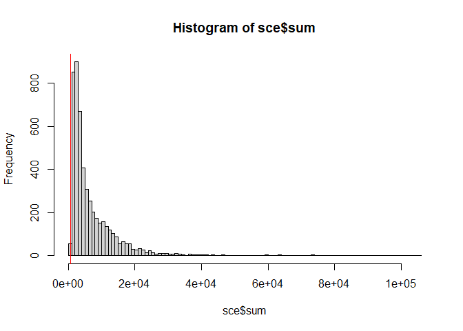
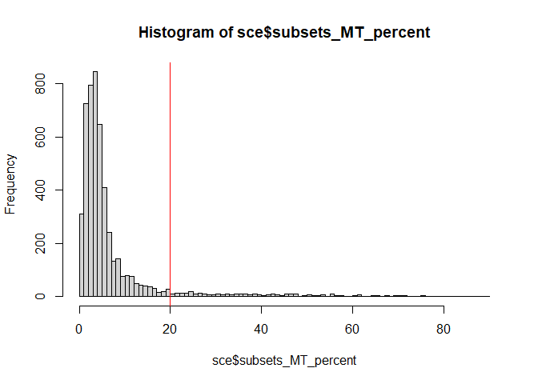

Basic Pipeline for scRNAseq Data Analysis : QC
================
Instructors : Somi Kim, Eunseo Park, Donggon Cha
2021/02/20

## Removal of low quality cells

To preprocess liver cancer scRNA-seq data, basic information of each cell of experimental design is necessary. Given sample information is loaded and organized. First, we set sample ID per each patient from its sample name to include liver cancer subtype information. We also set Diagnosis as liver cancer subtypes which are HCC or iCCA in this data.

``` r
library(DropletUtils)
library(dplyr)
library(scater)

dir = "E:/Project/KOGO_2021/rawdata"

sampleInfo <- read.table(paste0(dir, "/samples.txt"), header=TRUE, sep="\t")
head(sampleInfo)

sampleInfo$ID <- sapply(sampleInfo$Sample %>% as.character(), function(x) {strsplit(x, split="_")[[1]][3]}) 
sampleInfo$ID <- gsub("LCP", "", sampleInfo$ID)

orig.ids = sampleInfo$ID %>% as.factor() %>% levels()
new.ids = c("H18", "H21", "H23", "C25", "C26", "H28", 
            "C29", "H30", "C35", "H37", "H38", "C39")

for(i in orig.ids){
  new.id = new.ids[grep(i, new.ids)]
  sampleInfo[grep(i, sampleInfo$ID),]$ID = new.id
}
sampleInfo$Diagnosis = sampleInfo$ID
for(i in c("H", "C")){
  if(i == "H"){
    sampleInfo[grep(i, sampleInfo$ID),]$Diagnosis = "HCC"
  }else{
    sampleInfo[grep(i, sampleInfo$ID),]$Diagnosis = "iCCA"
  }
}
```

For preprocessing of scRNA-seq data, mapped reads are loaded as a **Singlecellexperiment (SCE)** object by read10XCounts() of **DropletUtils** R package. A SCE object contains a **gene-by-cell count matrix**, **gene data** (gene annotation, etc) and **cell data** (sample information, experimental condition information, etc). Gene information will be stored in rowData(SCE), and cell information is stored in colData(SCE). A gene-by-cell matrix is stored as a sparse matrix in a SCE object. Ensembl gene ids is transformed into gene symbol for eaiser further analysis. In colData(sce), Sample name, cancer histologic subtypes (Diagnosis), sample ID, cell type information (from the literature) is stored.

``` r
sce <- read10xCounts(
  samples = dir,
  type="sparse",
  col.names = TRUE
)
rownames(sce) = uniquifyFeatureNames(rowData(sce)$ID, rowData(sce)$Symbol)

sce$Sample = sampleInfo$Sample
sce$Diagnosis = sampleInfo$Diagnosis
sce$ID = sampleInfo$ID
sce$Type = sampleInfo$Type

sce
```

    ## class: SingleCellExperiment 
    ## dim: 20124 5115 
    ## metadata(1): Samples
    ## assays(1): counts
    ## rownames(20124): RP11-34P13.7 FO538757.2 ... AC233755.1 AC240274.1
    ## rowData names(2): ID Symbol
    ## colnames(5115): AAACCTGAGGCGTACA-1 AAACGGGAGATCGATA-1 ...
    ##   TTTATGCTCCTTAATC-13 TTTGTCAGTTTGGGCC-13
    ## colData names(5): Sample Barcode Diagnosis ID Type
    ## reducedDimNames(0):
    ## altExpNames(0):

To remove low quality cells, several values such as number of unique molecular identifiers (UMIs) per cell, number of genes detected per cell, the percentage of UMIs assigned to mitochondrial (MT) genes are calculated using **addPerCellQC()** of **scater** R package. We define poor quality cells with &lt; 700 UMIs and &gt; 20% of UMIs assigned to MT genes and excluded them. Criteria can be visualized as histograms as below.

``` r
library(scater)

mtgenes = rowData(sce)[grep("MT-", rowData(sce)$Symbol),]$Symbol
is.mito = rownames(sce) %in% mtgenes
table(is.mito)
```

    ## is.mito
    ## FALSE  TRUE 
    ## 20111    13

``` r
sce <- addPerCellQC(
  sce,
  subsets = list(MT=mtgenes),
  percent_top = c(50, 100, 200, 500), 
  detection_limit = 5
)

sce$log10_sum = log10(sce$sum + 1)
sce$log10_detected = log10(sce$detected + 1)

umi = 700
mtpct = 20

hist(sce$sum, breaks = 100)
abline(v = umi, col="red")
```



``` r
hist(sce$subsets_MT_percent, breaks=100)
abline(v=mtpct, col="red")
```



``` r
filter_by_total_counts = sce$sum > umi
filter_by_mt_percent = sce$subsets_MT_percent < mtpct

sce$use <- (
  filter_by_total_counts &
    filter_by_mt_percent 
)

sce = sce[,sce$use]
```

## Session information

``` r
sessionInfo()
```

    ## R version 4.0.2 (2020-06-22)
    ## Platform: x86_64-w64-mingw32/x64 (64-bit)
    ## Running under: Windows 10 x64 (build 17763)
    ## 
    ## Matrix products: default
    ## 
    ## locale:
    ## [1] LC_COLLATE=Korean_Korea.949  LC_CTYPE=Korean_Korea.949   
    ## [3] LC_MONETARY=Korean_Korea.949 LC_NUMERIC=C                
    ## [5] LC_TIME=Korean_Korea.949    
    ## 
    ## attached base packages:
    ## [1] parallel  stats4    stats     graphics  grDevices utils     datasets 
    ## [8] methods   base     
    ## 
    ## other attached packages:
    ##  [1] scater_1.16.2               ggplot2_3.3.3              
    ##  [3] dplyr_1.0.4                 DropletUtils_1.8.0         
    ##  [5] SingleCellExperiment_1.12.0 SummarizedExperiment_1.20.0
    ##  [7] Biobase_2.50.0              GenomicRanges_1.42.0       
    ##  [9] GenomeInfoDb_1.26.2         IRanges_2.24.1             
    ## [11] S4Vectors_0.28.1            BiocGenerics_0.36.0        
    ## [13] MatrixGenerics_1.2.1        matrixStats_0.58.0         
    ## 
    ## loaded via a namespace (and not attached):
    ##  [1] rsvd_1.0.3                Rcpp_1.0.6               
    ##  [3] locfit_1.5-9.4            lattice_0.20-41          
    ##  [5] assertthat_0.2.1          digest_0.6.27            
    ##  [7] R6_2.5.0                  evaluate_0.14            
    ##  [9] highr_0.8                 pillar_1.4.7             
    ## [11] zlibbioc_1.36.0           rlang_0.4.10             
    ## [13] irlba_2.3.3               R.utils_2.10.1           
    ## [15] R.oo_1.24.0               Matrix_1.2-18            
    ## [17] rmarkdown_2.6             BiocNeighbors_1.6.0      
    ## [19] BiocParallel_1.22.0       stringr_1.4.0            
    ## [21] RCurl_1.98-1.2            munsell_0.5.0            
    ## [23] DelayedArray_0.16.1       HDF5Array_1.16.1         
    ## [25] vipor_0.4.5               BiocSingular_1.4.0       
    ## [27] compiler_4.0.2            xfun_0.20                
    ## [29] pkgconfig_2.0.3           ggbeeswarm_0.6.0         
    ## [31] htmltools_0.5.1.1         tidyselect_1.1.0         
    ## [33] gridExtra_2.3             tibble_3.0.6             
    ## [35] GenomeInfoDbData_1.2.4    edgeR_3.30.3             
    ## [37] viridisLite_0.3.0         crayon_1.4.0             
    ## [39] withr_2.4.1               bitops_1.0-6             
    ## [41] R.methodsS3_1.8.1         grid_4.0.2               
    ## [43] gtable_0.3.0              lifecycle_0.2.0          
    ## [45] DBI_1.1.1                 magrittr_2.0.1           
    ## [47] scales_1.1.1              dqrng_0.2.1              
    ## [49] stringi_1.5.3             XVector_0.30.0           
    ## [51] viridis_0.5.1             limma_3.44.3             
    ## [53] DelayedMatrixStats_1.10.1 ellipsis_0.3.1           
    ## [55] generics_0.1.0            vctrs_0.3.6              
    ## [57] Rhdf5lib_1.10.1           tools_4.0.2              
    ## [59] beeswarm_0.2.3            glue_1.4.2               
    ## [61] purrr_0.3.4               yaml_2.2.1               
    ## [63] colorspace_2.0-0          rhdf5_2.32.4             
    ## [65] knitr_1.31

## References

L. Ma, M.O. Hernandez, Y. Zhao, M. Mehta, B. Tran, M. Kelly, Z. Rae, J.M. Hernandez, J.L. Davis, S.P. Martin, D.E. Kleiner, S.M. Hewitt, K. Ylaya, B.J. Wood, T.F. Greten, X.W. Wang. Tumor cell biodiversity drives microenvironmental reprogramming in liver cancer. Canc. Cell, 36 (4): 418-430 (2019)

McCarthy, D. J., Campbell, K. R., Lun, A. T. & Wills, Q. F. Scater: pre-processing, quality control, normalization and visualization of single-cell RNA-seq data in R. Bioinformatics 33, 1179–1186 (2017)

Butler, A., Hoffman, P., Smibert, P., Papalexi, E. & Satija, R. Integrating single-cell transcriptomic data across different conditions, technologies, and species. Nat. Biotechnol. 36, 411–420 (2018).
