Basic Pipeline for scRNAseq Data Analysis: Seurat pipeline
================
Instructors : Somi Kim, Eunseo Park, Donggon Cha
2021/07/06

# Basic Pipeline

After quality control, basic processes including normalization, feature selection and visualization is performed.

## load data

SingleCellExperiment object which quality control (QC) was done should be loaded.

## Normalization & Feature Selection

In Seurat, functions for normalization and feature selection are implemented. By **NormalizeData()** function of **Seurat** R package, feature expression measurements are normalized for each cell by the total expression, multiplied by a scale factor (10,000 by default), and log-transformed. The normalized data is stored in **Object\[\["originalexp"\]\]@data** slot. Next, a subset of features that exhibit high cell-to-cell variation in the data is calculated by **FindVariableFeatures()** function of the same package. Then a linear transformation (scaling) is applied prior to dimensional reduction techniques by **ScaleData()** function. Scaled values are stored in **Object\[\["originalexp"\]\]@scale.data** slot.

``` r
library(Seurat)
library(dplyr)
library(RColorBrewer)

logcounts(sce) <- log2(counts(sce) + 1)
logcounts(sce) <- as(logcounts(sce), "sparseMatrix")
seurat <- as.Seurat(sce) %>% NormalizeData() %>% FindVariableFeatures()
seurat <- ScaleData(seurat, features = VariableFeatures(seurat))
```

## Dimension Reduction

For downstream analysis, we perform PCA on the scaled data with highly variable features.

``` r
hvg.norm <- VariableFeatures(seurat)

seurat <- RunPCA(seurat,
                 npcs = 50,
                 features = hvg.norm,
                 reduction.key = "pca_",
                 verbose = FALSE)
plot((seurat@reductions$pca@stdev)^2,
     xlab = "PC",
     ylab = "Eigenvalue")
```

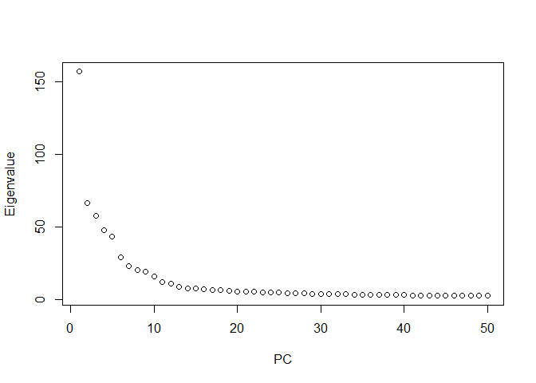

We set to 15 PCs for clustering and visualization. After clustering and visualization, cells are plotted in the two-dimensional TSNE or UMAP plot and cell information can be also shown.

``` r
PCA=15

seurat <- FindNeighbors(seurat, dims=1:PCA)
seurat <- FindClusters(seurat, resolution = 0.8)
```

    ## Modularity Optimizer version 1.3.0 by Ludo Waltman and Nees Jan van Eck
    ## 
    ## Number of nodes: 4749
    ## Number of edges: 158243
    ## 
    ## Running Louvain algorithm...
    ## Maximum modularity in 10 random starts: 0.9082
    ## Number of communities: 19
    ## Elapsed time: 0 seconds

``` r
seurat <- RunTSNE(seurat, dims = 1:PCA)
seurat <- RunUMAP(seurat, dims = 1:PCA)

TSNEPlot(seurat, group.by = "ID", pt.size = 1)
```

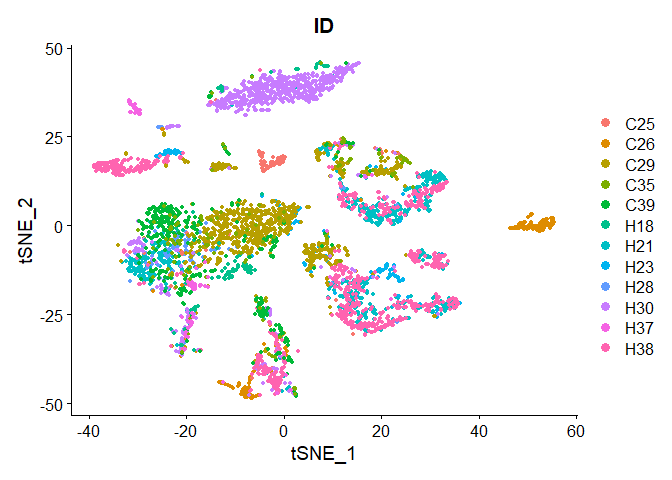

``` r
UMAPPlot(seurat, group.by = "ID", pt.size = 1)
```

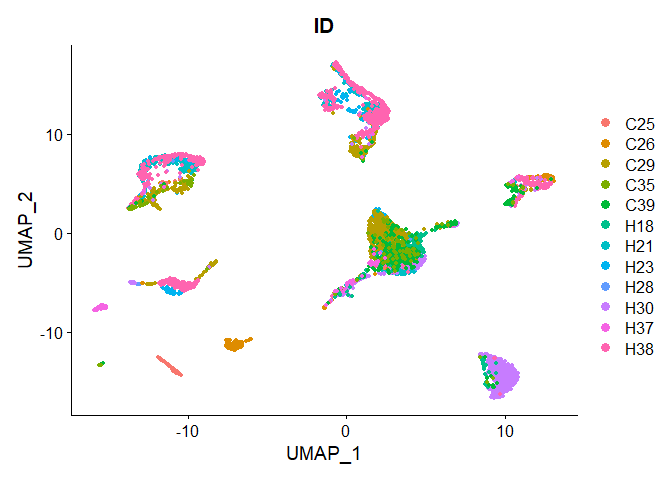

## Seurat Integration for Batch Correction

``` r
seurat_list <- SplitObject(seurat, split.by = "ID")

for (i in 1:length(seurat_list)) {
  seurat_list[[i]] <- NormalizeData(seurat_list[[i]])
  seurat_list[[i]] <- FindVariableFeatures(seurat_list[[i]])
}

features <- SelectIntegrationFeatures(object.list = seurat_list)

anchors <- FindIntegrationAnchors(object.list = seurat_list,
                                  anchor.features = features, 
                                  k.filter = 100)
integrated <- IntegrateData(anchorset = anchors, dims = 1:10)

integrated <- ScaleData(integrated)
integrated <- RunPCA(integrated,
                     npcs = 50,
                     weight.by.var = F)
plot((integrated@reductions$pca@stdev)^2,
     xlab = "PC",
     ylab = "Eigenvalue")
```

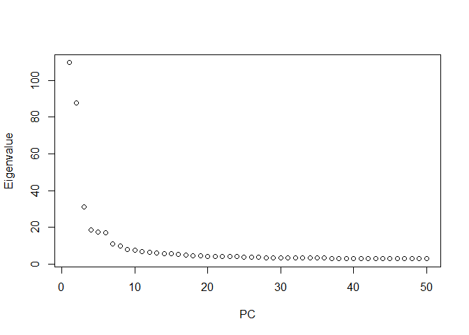

We set to 15 PCs for clustering and visualization. After clustering and visualization, cells are plotted in the two-dimensional TSNE or UMAP plot and cell information can be also shown.

``` r
PCA = 15

set.seed(10)
integrated <- FindNeighbors(integrated, dims = 1:PCA)
integrated <- FindClusters(integrated, resolution = 0.2)
```

    ## Modularity Optimizer version 1.3.0 by Ludo Waltman and Nees Jan van Eck
    ## 
    ## Number of nodes: 4749
    ## Number of edges: 164634
    ## 
    ## Running Louvain algorithm...
    ## Maximum modularity in 10 random starts: 0.9377
    ## Number of communities: 9
    ## Elapsed time: 0 seconds

``` r
integrated <- RunUMAP(integrated,
                      reduction = "pca",
                      dims = 1:PCA)
integrated <- RunTSNE(integrated,
                      reduction = "pca",
                      dims = 1:PCA,
                      check_duplicates = FALSE)

DimPlot(integrated, reduction = "umap", group.by = "ID", pt.size = 1)
```

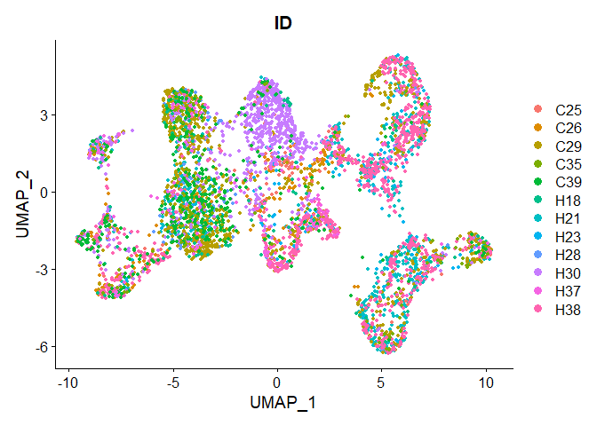

``` r
DimPlot(integrated, reduction = "tsne", group.by = "ID", pt.size = 1)
```

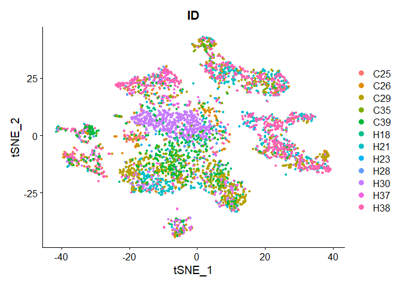

``` r
DimPlot(integrated, reduction = "tsne", group.by = "seurat_clusters", pt.size=1, label=TRUE, label.size=10)
```

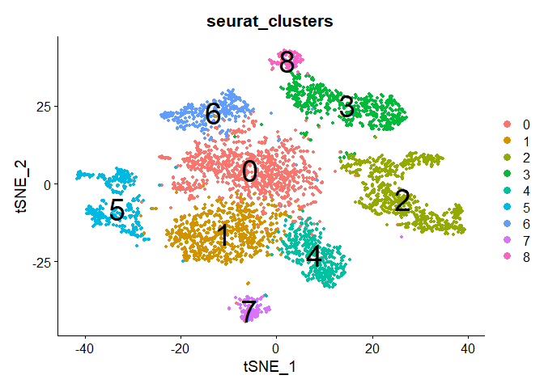

``` r
DimPlot(integrated, reduction = "umap", group.by = "seurat_clusters", pt.size=1, label=TRUE, label.size=10)
```

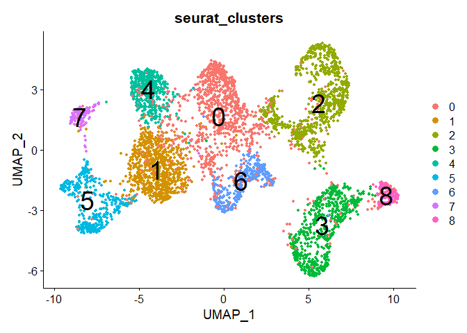

## Identification of cell types

Based on 'seurat\_clusters' after clustering, cells are grouped according to their cell types as annotated based on known cell lineage-specific marker genes of T cells, B cells, cancer-associated fibroblasts (CAFs), tumor-associated macrophages (TAMs), tumor-associated endothelial cells (TECs), and cells with an unknown entity but express hepatic progenitor cell markers (HPC-like).

``` r
markers = list(T.cells = c("CD2", "CD3E", "CD3D", "CD3G"), #cluster 1,4
               B.cells = c("CD79A", "SLAMF7", "BLNK", "FCRL5"), #cluster 0
               TECs = c("PECAM1", "VWF", "ENG", "CDH5"), #cluster 2
               CAFs = c("COL1A2", "FAP", "PDPN", "DCN", "COL3A1", "COL6A1"), #cluster 3,8
               TAMs = c("CD14", "CD163", "CD68", "CSF1R"), #cluster 5,7
               HPC.like = c("EPCAM", "KRT19", "PROM1", "ALDH1A1", "CD24") #cluster 6
)
```

``` r
#check marker expressions-scatterplot
DefaultAssay(integrated) <- "RNA"
```

Expression pattern of T cell-specific marker genes are shown below.

``` r
FeaturePlot(integrated,
            features = markers$T.cells,
            order = T,
            pt.size = 1,
            ncol = 2)
```

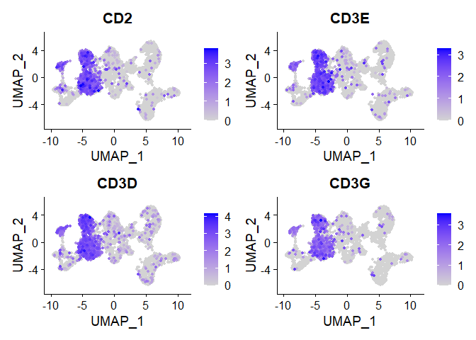

Expression pattern of B cell-specific marker genes are shown below.

``` r
FeaturePlot(integrated,
            features = markers$B.cells,
            order = T,
            pt.size = 1,
            ncol = 2)
```

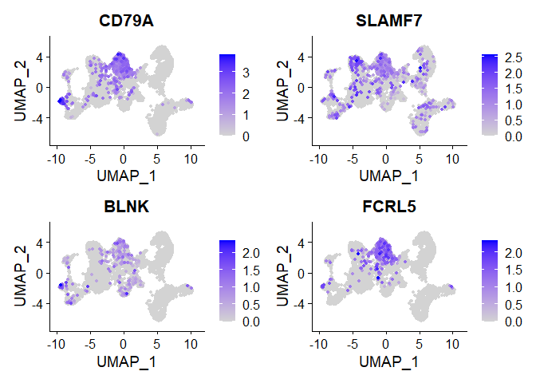

Expression pattern of TEC-specific marker genes are shown below.

``` r
FeaturePlot(integrated,
            features = markers$TECs,
            order = T,
            pt.size = 1,
            ncol = 2)
```

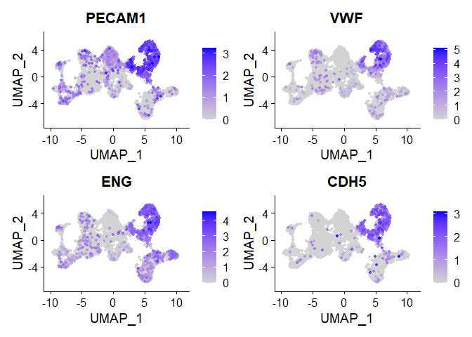

Expression pattern of CAF-specific marker genes are shown below.

``` r
FeaturePlot(integrated,
            features = markers$CAFs,
            order = T,
            pt.size = 1,
            ncol = 2)
```

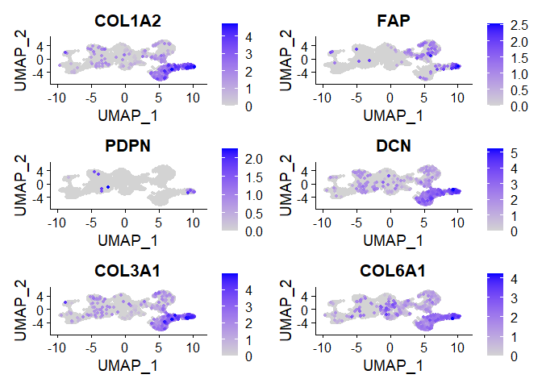

Expression pattern of TAM-specific marker genes are shown below.

``` r
FeaturePlot(integrated,
            features = markers$TAMs,
            order = T,
            pt.size = 1,
            ncol = 2)
```

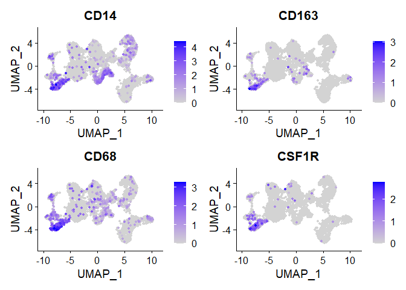

Expression pattern of HPC-like cell marker genes are shown below.

``` r
FeaturePlot(integrated,
            features = markers$HPC.like,
            order = T,
            pt.size = 1,
            ncol = 2)
```

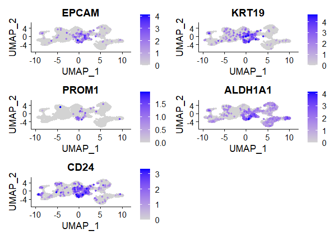

Additionally, expression patterns of cell lineage-specific marker genes are shown by heatmap. By heatmap, it is possible to compare expression of marker genes between each cluster.

``` r
library(pheatmap)

avgExprs <- AverageExpression(integrated,
                              features = unlist(markers),
                              assays = "RNA", slot = "data")

scaledExprs <- t(scale(t(avgExprs$RNA)))
scaledExprs[scaledExprs > -min(scaledExprs)] <- -min(scaledExprs)

palette_length = 100
my_color = colorRampPalette(rev(brewer.pal(11, "RdBu")))(palette_length)

my_breaks <- c(seq(min(scaledExprs), 0,
                   length.out=ceiling(palette_length/2) + 1),
               seq(max(scaledExprs)/palette_length,
                   max(scaledExprs),
                   length.out=floor(palette_length/2)))

pheatmap(scaledExprs,
         cluster_cols = T, cluster_rows = F, clustering_method = "ward.D2",
         treeheight_col = 0,
         breaks = my_breaks, color=my_color,
         labels_row = as.expression(lapply(rownames(scaledExprs), function(a) bquote(italic(.(a))))),
         angle_col = 315
)
```

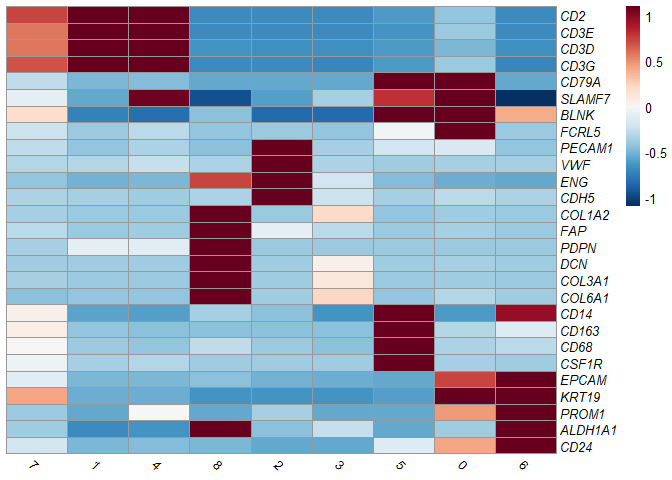

Finally, cell types are annotated based on clusters.

``` r
integrated$celltype <- integrated$seurat_clusters

integrated$celltype = gsub(8, "CAF", integrated$celltype)
integrated$celltype = gsub(7, "TAM", integrated$celltype)
integrated$celltype = gsub(6, "HPC.like", integrated$celltype)
integrated$celltype = gsub(5, "TAM", integrated$celltype)
integrated$celltype = gsub(4, "T.cell", integrated$celltype)
integrated$celltype = gsub(3, "CAF", integrated$celltype)
integrated$celltype = gsub(2, "TEC", integrated$celltype)
integrated$celltype = gsub(1, "T.cell", integrated$celltype)
integrated$celltype = gsub(0, "B.cell", integrated$celltype)


DimPlot(integrated, 
        reduction = "umap", 
        group.by = "celltype", 
        pt.size=1, 
        label=TRUE, 
        label.size=10)
```

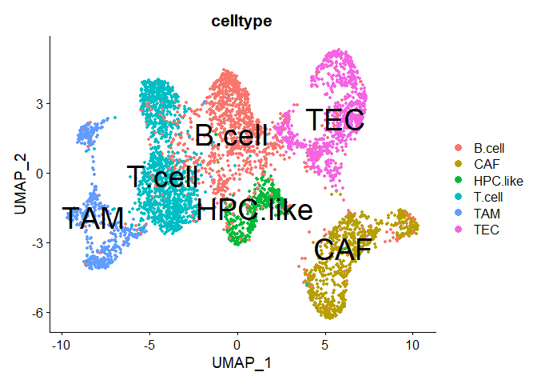

## Session information

``` r
sessionInfo()
```

    ## R version 4.0.2 (2020-06-22)
    ## Platform: x86_64-w64-mingw32/x64 (64-bit)
    ## Running under: Windows 10 x64 (build 17763)
    ## 
    ## Matrix products: default
    ## 
    ## locale:
    ## [1] LC_COLLATE=Korean_Korea.949  LC_CTYPE=Korean_Korea.949   
    ## [3] LC_MONETARY=Korean_Korea.949 LC_NUMERIC=C                
    ## [5] LC_TIME=Korean_Korea.949    
    ## 
    ## attached base packages:
    ## [1] parallel  stats4    stats     graphics  grDevices utils     datasets 
    ## [8] methods   base     
    ## 
    ## other attached packages:
    ##  [1] pheatmap_1.0.12             SingleCellExperiment_1.12.0
    ##  [3] SummarizedExperiment_1.20.0 Biobase_2.50.0             
    ##  [5] GenomicRanges_1.42.0        GenomeInfoDb_1.26.2        
    ##  [7] IRanges_2.24.1              S4Vectors_0.28.1           
    ##  [9] BiocGenerics_0.36.0         MatrixGenerics_1.2.1       
    ## [11] matrixStats_0.58.0          RColorBrewer_1.1-2         
    ## [13] dplyr_1.0.4                 SeuratObject_4.0.0         
    ## [15] Seurat_4.0.0               
    ## 
    ## loaded via a namespace (and not attached):
    ##   [1] Rtsne_0.15             colorspace_2.0-0       deldir_0.2-9          
    ##   [4] ellipsis_0.3.1         ggridges_0.5.3         XVector_0.30.0        
    ##   [7] spatstat.data_1.7-0    farver_2.0.3           leiden_0.3.7          
    ##  [10] listenv_0.8.0          ggrepel_0.9.1          RSpectra_0.16-0       
    ##  [13] codetools_0.2-16       splines_4.0.2          knitr_1.31            
    ##  [16] polyclip_1.10-0        jsonlite_1.7.2         ica_1.0-2             
    ##  [19] cluster_2.1.0          png_0.1-7              uwot_0.1.10           
    ##  [22] shiny_1.6.0            sctransform_0.3.2      compiler_4.0.2        
    ##  [25] httr_1.4.2             assertthat_0.2.1       Matrix_1.2-18         
    ##  [28] fastmap_1.1.0          lazyeval_0.2.2         later_1.1.0.1         
    ##  [31] htmltools_0.5.1.1      tools_4.0.2            igraph_1.2.6          
    ##  [34] gtable_0.3.0           glue_1.4.2             GenomeInfoDbData_1.2.4
    ##  [37] RANN_2.6.1             reshape2_1.4.4         Rcpp_1.0.6            
    ##  [40] spatstat_1.64-1        scattermore_0.7        vctrs_0.3.6           
    ##  [43] nlme_3.1-148           lmtest_0.9-38          xfun_0.20             
    ##  [46] stringr_1.4.0          globals_0.14.0         mime_0.9              
    ##  [49] miniUI_0.1.1.1         lifecycle_0.2.0        irlba_2.3.3           
    ##  [52] goftest_1.2-2          future_1.21.0          zlibbioc_1.36.0       
    ##  [55] MASS_7.3-51.6          zoo_1.8-8              scales_1.1.1          
    ##  [58] promises_1.1.1         spatstat.utils_2.0-0   yaml_2.2.1            
    ##  [61] reticulate_1.18        pbapply_1.4-3          gridExtra_2.3         
    ##  [64] ggplot2_3.3.3          rpart_4.1-15           stringi_1.5.3         
    ##  [67] highr_0.8              rlang_0.4.10           pkgconfig_2.0.3       
    ##  [70] bitops_1.0-6           evaluate_0.14          lattice_0.20-41       
    ##  [73] ROCR_1.0-11            purrr_0.3.4            tensor_1.5            
    ##  [76] labeling_0.4.2         patchwork_1.1.1        htmlwidgets_1.5.3     
    ##  [79] cowplot_1.1.1          tidyselect_1.1.0       parallelly_1.23.0     
    ##  [82] RcppAnnoy_0.0.18       plyr_1.8.6             magrittr_2.0.1        
    ##  [85] R6_2.5.0               generics_0.1.0         DelayedArray_0.16.1   
    ##  [88] DBI_1.1.1              pillar_1.4.7           mgcv_1.8-31           
    ##  [91] fitdistrplus_1.1-3     survival_3.1-12        abind_1.4-5           
    ##  [94] RCurl_1.98-1.2         tibble_3.0.6           future.apply_1.7.0    
    ##  [97] crayon_1.4.0           KernSmooth_2.23-18     plotly_4.9.3          
    ## [100] rmarkdown_2.6          grid_4.0.2             data.table_1.13.6     
    ## [103] digest_0.6.27          xtable_1.8-4           tidyr_1.1.2           
    ## [106] httpuv_1.5.5           munsell_0.5.0          viridisLite_0.3.0

## References

L. Ma, M.O. Hernandez, Y. Zhao, M. Mehta, B. Tran, M. Kelly, Z. Rae, J.M. Hernandez, J.L. Davis, S.P. Martin, D.E. Kleiner, S.M. Hewitt, K. Ylaya, B.J. Wood, T.F. Greten, X.W. Wang. Tumor cell biodiversity drives microenvironmental reprogramming in liver cancer. Canc. Cell, 36 (4): 418-430 (2019)

Butler, A., Hoffman, P., Smibert, P., Papalexi, E. & Satija, R. Integrating single-cell transcriptomic data across different conditions, technologies, and species. Nat. Biotechnol. 36, 411–420 (2018).

Stuart, T., Butler, A., Hoffman, P., Hafemeister, C., Papalexi, E., Mauck III, W. M., ... & Satija, R. (2019). Comprehensive integration of single-cell data. Cell, 177(7), 1888-1902.
