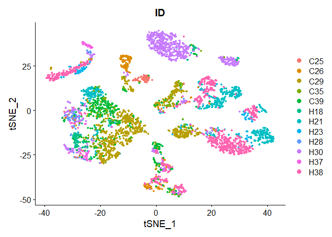
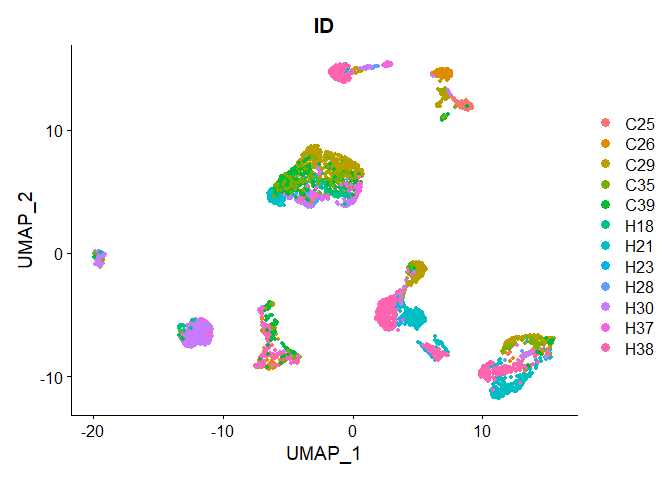
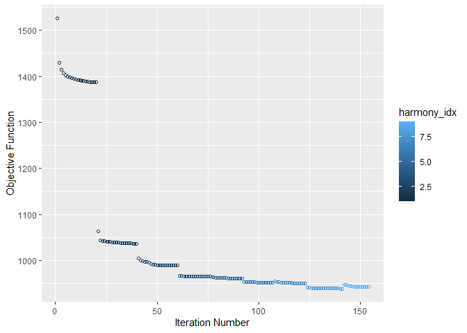
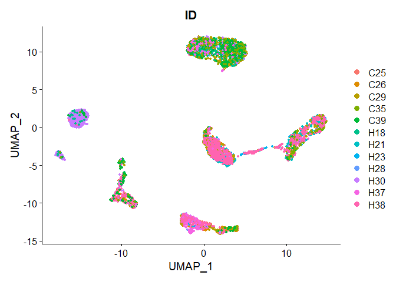
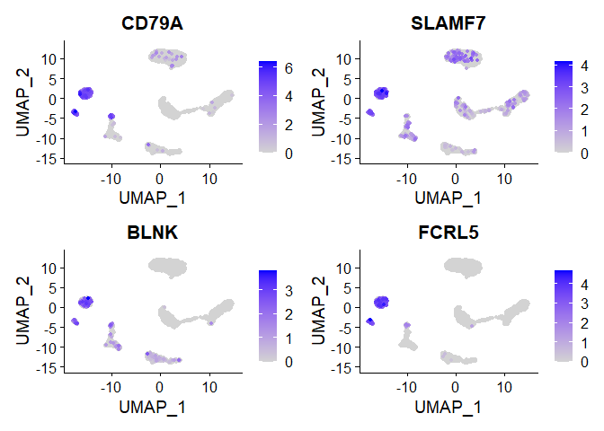
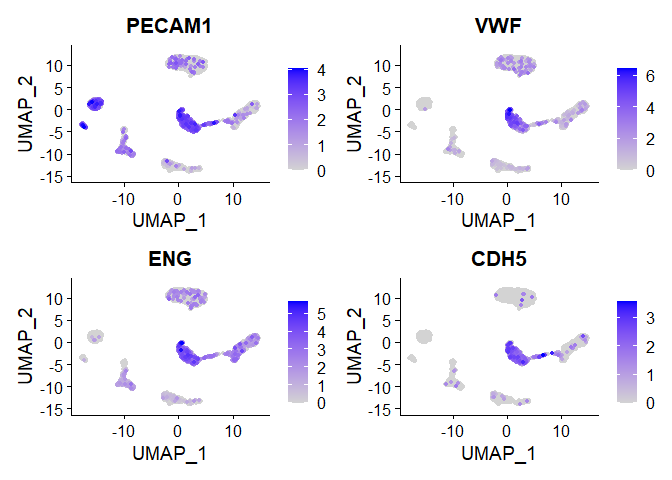
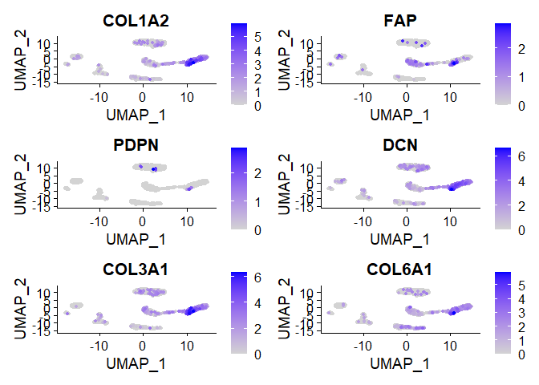
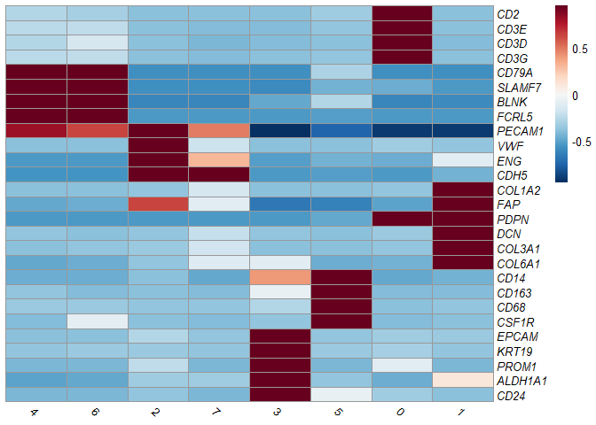
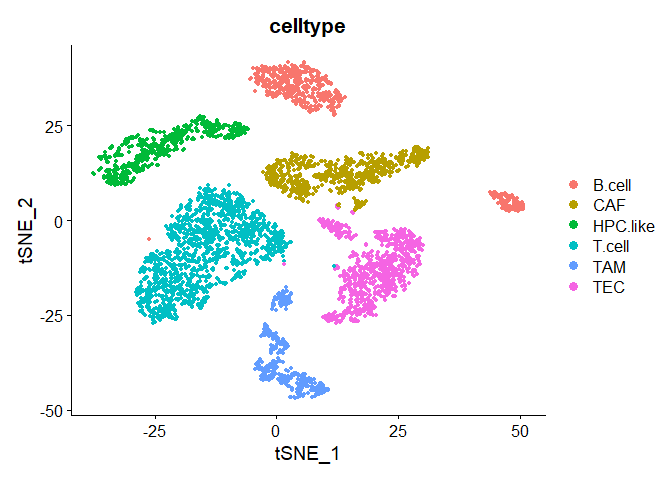

Basic Pipeline for scRNAseq Data Analysis: SCGL pipeline
================
Instructors : Somi Kim, Eunseo Park, Donggon Cha
2021/07/06

# Basic Pipeline

After quality control, basic processes including normalization, feature selection and visualization is performed.

## load data

SingleCellExperiment object which quality control (QC) was done should be loaded.

## Normalization

To remove cell-specific biases, cells are clustered using **quickCluster()** and cell-specific size factors are calculated using **computeSumFactors()** of **scran** R package. Raw counts of each cell are divided by cell-specific size factor and **log2-transformed** with a pseudocount of 1.

``` r
library(scater)
library(scran)

clusters <- quickCluster(sce)
sce <- computeSumFactors(sce, clusters = clusters)
print(summary(sizeFactors(sce)))
```

    ##     Min.  1st Qu.   Median     Mean  3rd Qu.     Max. 
    ##  0.09539  0.32598  0.54100  1.00000  1.06519 15.19534

``` r
sce.norm <- logNormCounts(sce, pseudo_count = 1)
```

## Feature Selection

To find genes contain useful information about the biology of the data, highly variable genes (HVGs) are defined by selecting the most variable genes based on their expression across cells. Genes with **&lt; 0.05 of false discovery rate (FDR)** are identified as HVGs.

``` r
dec <- modelGeneVar(sce.norm)
plot(dec$mean, dec$total, xlab="Mean log-expression", ylab="Variance")
curve(metadata(dec)$trend(x), col="blue", add=TRUE)
```


``` r
hvg.norm <- getTopHVGs(dec, fdr.threshold = 0.05)
length(hvg.norm) # 551 genes
```

    ## [1] 551

## Dimension Reduction

For downstream analysis, we create Seurat object containing raw and normalized gene-by-cell count matrices. Column data (cell information) is preserved. Normalized data is scaled and principal components (PCs) are calculated by a gene-by-cell matrix with HVGs.

``` r
library(Seurat)

seurat <- as.Seurat(sce.norm,
                    counts = "counts",
                    data = "logcounts",
                    assay = "originalexp")
VariableFeatures(seurat) = hvg.norm

all.genes = rownames(seurat)
seurat <- ScaleData(seurat, features = all.genes)

seurat <- RunPCA(seurat,
                 assay = "originalexp",
                 npcs = 50,
                 features = hvg.norm,
                 reduction.key = "pca_",
                 verbose = FALSE)
plot((seurat@reductions$pca@stdev)^2,
     xlab = "PC",
     ylab = "Eigenvalue")
```


We set to 15 PCs for clustering and visualization. After clustering and visualization, cells are plotted in the two-dimensional TSNE or UMAP plot and cell information can be also shown.

``` r
PCA=15

seurat <- FindNeighbors(seurat, dims=1:PCA)
seurat <- FindClusters(seurat, resolution = 0.2)
```

    ## Modularity Optimizer version 1.3.0 by Ludo Waltman and Nees Jan van Eck
    ## 
    ## Number of nodes: 4749
    ## Number of edges: 155861
    ## 
    ## Running Louvain algorithm...
    ## Maximum modularity in 10 random starts: 0.9654
    ## Number of communities: 10
    ## Elapsed time: 0 seconds

``` r
seurat <- RunTSNE(seurat, dims = 1:PCA)
seurat <- RunUMAP(seurat, dims = 1:PCA)

TSNEPlot(seurat, group.by = "ID", pt.size = 1)
```



``` r
UMAPPlot(seurat, group.by = "ID", pt.size = 1)
```



## Batch Correction

On the previous TSNE (or UMAP) plot, batch effect is shown. Batch effect is removed using **RunHarmony()** in **Harmony** R package. After using RunHarmony(), it returns a Seurat object, updated with the corrected Harmony coordinates. Using the corrected Harmony coordinates, clustering and visualization are processed same as before batch correction.

``` r
library(harmony)

seurat <- RunHarmony(seurat, "ID", plot_convergence = TRUE)
```



``` r
nComp = 15
seurat <- FindNeighbors(seurat, 
                        reduction = "harmony",
                        dims=1:nComp)
seurat <- FindClusters(seurat, resolution = 0.2)
```

    ## Modularity Optimizer version 1.3.0 by Ludo Waltman and Nees Jan van Eck
    ## 
    ## Number of nodes: 4749
    ## Number of edges: 175426
    ## 
    ## Running Louvain algorithm...
    ## Maximum modularity in 10 random starts: 0.9640
    ## Number of communities: 8
    ## Elapsed time: 0 seconds

``` r
seurat <- RunTSNE(seurat,
                  reduction = "harmony",
                  dims = 1:nComp,
                  check_duplicates = FALSE)
seurat <- RunUMAP(seurat,
                  reduction = "harmony",
                  dims = 1:nComp)
```

Batch effect between patients are removed after using harmony.

``` r
DimPlot(seurat, reduction = "umap", group.by = "ID", pt.size = 1)
```



Also, clustering is done with the corrected Harmony coordinates.

``` r
DimPlot(seurat, reduction = "umap", group.by = "seurat_clusters", pt.size=1, label=TRUE, label.size=10)
```


## Identification of cell types

Based on 'seurat\_clusters' after clustering, cells are grouped according to their cell types as annotated based on known cell lineage-specific marker genes of T cells, B cells, cancer-associated fibroblasts (CAFs), tumor-associated macrophages (TAMs), tumor-associated endothelial cells (TECs), and cells with an unknown entity but express hepatic progenitor cell markers (HPC-like).

``` r
library(ggplot2)
library(pheatmap)
library(RColorBrewer)

markers = list(
  T.cells = c("CD2", "CD3E", "CD3D", "CD3G"), #cluster 0
  B.cells = c("CD79A", "SLAMF7", "BLNK", "FCRL5"), #cluster 4,6
  TECs = c("PECAM1", "VWF", "ENG", "CDH5"), #cluster 2,7
  CAFs = c("COL1A2", "FAP", "PDPN", "DCN", "COL3A1", "COL6A1"), #cluster 1
  TAMs = c("CD14", "CD163", "CD68", "CSF1R"), #cluster 5
  HPC.like = c("EPCAM", "KRT19", "PROM1", "ALDH1A1", "CD24") #cluster 3
)
```

Expression pattern of T cell-specific marker genes are shown below.

``` r
FeaturePlot(seurat,
            features = markers$T.cells,
            order = T,
            pt.size = 1,
            ncol = 2)
```


Expression pattern of B cell-specific marker genes are shown below.

``` r
FeaturePlot(seurat,
            features = markers$B.cells,
            order = T,
            pt.size = 1,
            ncol = 2)
```



Expression pattern of TEC-specific marker genes are shown below.

``` r
FeaturePlot(seurat,
            features = markers$TECs,
            order = T,
            pt.size = 1,
            ncol = 2)
```



Expression pattern of CAF-specific marker genes are shown below.

``` r
FeaturePlot(seurat,
            features = markers$CAFs,
            order = T,
            pt.size = 1,
            ncol = 2)
```



Expression pattern of TAM-specific marker genes are shown below.

``` r
FeaturePlot(seurat,
            features = markers$TAMs,
            order = T,
            pt.size = 1,
            ncol = 2)
```


Expression pattern of HPC-like cell marker genes are shown below.

``` r
FeaturePlot(seurat,
            features = markers$HPC.like,
            order = T,
            pt.size = 1,
            ncol = 2)
```


Additionally, expression patterns of cell lineage-specific marker genes are shown by heatmap. By heatmap, it is possible to compare expression of marker genes between each cluster.

``` r
avgExprs <- AverageExpression(seurat,
                              features = unlist(markers),
                              assays = "originalexp", slot = "data")

scaledExprs <- t(scale(t(avgExprs$originalexp)))
scaledExprs[scaledExprs > -min(scaledExprs)] <- -min(scaledExprs)

palette_length = 100
my_color = colorRampPalette(rev(brewer.pal(11, "RdBu")))(palette_length)

my_breaks <- c(seq(min(scaledExprs), 0,
                   length.out=ceiling(palette_length/2) + 1),
               seq(max(scaledExprs)/palette_length,
                   max(scaledExprs),
                   length.out=floor(palette_length/2)))

pheatmap(scaledExprs,
         cluster_cols = T, cluster_rows = F, clustering_method = "ward.D2",
         treeheight_col = 0,
         breaks = my_breaks, color=my_color,
         labels_row = as.expression(lapply(rownames(scaledExprs), function(a) bquote(italic(.(a))))),
         angle_col = 315
)
```



Finally, cell types are annotated based on clusters.

``` r
seurat$celltype = seurat$seurat_clusters

seurat$celltype = gsub(0, "T.cell", seurat$celltype)
seurat$celltype = gsub(1, "CAF", seurat$celltype)
seurat$celltype = gsub(2, "TEC", seurat$celltype)
seurat$celltype = gsub(3, "HPC.like", seurat$celltype)
seurat$celltype = gsub(4, "B.cell", seurat$celltype)
seurat$celltype = gsub(5, "TAM", seurat$celltype)
seurat$celltype = gsub(6, "B.cell", seurat$celltype)
seurat$celltype = gsub(7, "TEC", seurat$celltype)

DimPlot(seurat, 
        reduction="umap", 
        group.by="celltype",
        pt.size = 1)
```



``` r
DimPlot(seurat, 
        reduction="tsne", 
        group.by="celltype",
        pt.size = 1)
```


## Session information

``` r
sessionInfo()
```

    ## R version 4.0.2 (2020-06-22)
    ## Platform: x86_64-w64-mingw32/x64 (64-bit)
    ## Running under: Windows 10 x64 (build 19042)
    ## 
    ## Matrix products: default
    ## 
    ## locale:
    ## [1] LC_COLLATE=Korean_Korea.949  LC_CTYPE=Korean_Korea.949   
    ## [3] LC_MONETARY=Korean_Korea.949 LC_NUMERIC=C                
    ## [5] LC_TIME=Korean_Korea.949    
    ## 
    ## attached base packages:
    ## [1] parallel  stats4    stats     graphics  grDevices utils     datasets 
    ## [8] methods   base     
    ## 
    ## other attached packages:
    ##  [1] RColorBrewer_1.1-2          pheatmap_1.0.12            
    ##  [3] harmony_1.0                 Rcpp_1.0.6                 
    ##  [5] SeuratObject_4.0.0          Seurat_4.0.0               
    ##  [7] scran_1.16.0                scater_1.16.2              
    ##  [9] ggplot2_3.3.3               SingleCellExperiment_1.12.0
    ## [11] SummarizedExperiment_1.20.0 Biobase_2.50.0             
    ## [13] GenomicRanges_1.42.0        GenomeInfoDb_1.26.2        
    ## [15] IRanges_2.24.1              S4Vectors_0.28.1           
    ## [17] BiocGenerics_0.36.0         MatrixGenerics_1.2.1       
    ## [19] matrixStats_0.58.0         
    ## 
    ## loaded via a namespace (and not attached):
    ##   [1] plyr_1.8.6                igraph_1.2.6             
    ##   [3] lazyeval_0.2.2            splines_4.0.2            
    ##   [5] BiocParallel_1.22.0       listenv_0.8.0            
    ##   [7] scattermore_0.7           digest_0.6.27            
    ##   [9] htmltools_0.5.1.1         viridis_0.5.1            
    ##  [11] magrittr_2.0.1            tensor_1.5               
    ##  [13] cluster_2.1.0             ROCR_1.0-11              
    ##  [15] limma_3.44.3              globals_0.14.0           
    ##  [17] colorspace_2.0-0          ggrepel_0.9.1            
    ##  [19] xfun_0.20                 dplyr_1.0.4              
    ##  [21] crayon_1.4.0              RCurl_1.98-1.2           
    ##  [23] jsonlite_1.7.2            spatstat_1.64-1          
    ##  [25] spatstat.data_1.7-0       survival_3.1-12          
    ##  [27] zoo_1.8-8                 glue_1.4.2               
    ##  [29] polyclip_1.10-0           gtable_0.3.0             
    ##  [31] zlibbioc_1.36.0           XVector_0.30.0           
    ##  [33] leiden_0.3.7              DelayedArray_0.16.1      
    ##  [35] BiocSingular_1.4.0        future.apply_1.7.0       
    ##  [37] abind_1.4-5               scales_1.1.1             
    ##  [39] DBI_1.1.1                 edgeR_3.30.3             
    ##  [41] miniUI_0.1.1.1            viridisLite_0.3.0        
    ##  [43] xtable_1.8-4              reticulate_1.18          
    ##  [45] dqrng_0.2.1               rsvd_1.0.3               
    ##  [47] htmlwidgets_1.5.3         httr_1.4.2               
    ##  [49] ellipsis_0.3.1            ica_1.0-2                
    ##  [51] farver_2.0.3              pkgconfig_2.0.3          
    ##  [53] uwot_0.1.10               deldir_0.2-9             
    ##  [55] locfit_1.5-9.4            labeling_0.4.2           
    ##  [57] tidyselect_1.1.0          rlang_0.4.10             
    ##  [59] reshape2_1.4.4            later_1.1.0.1            
    ##  [61] munsell_0.5.0             tools_4.0.2              
    ##  [63] generics_0.1.0            ggridges_0.5.3           
    ##  [65] evaluate_0.14             stringr_1.4.0            
    ##  [67] fastmap_1.1.0             yaml_2.2.1               
    ##  [69] goftest_1.2-2             knitr_1.31               
    ##  [71] fitdistrplus_1.1-3        purrr_0.3.4              
    ##  [73] RANN_2.6.1                pbapply_1.4-3            
    ##  [75] future_1.21.0             nlme_3.1-148             
    ##  [77] mime_0.9                  compiler_4.0.2           
    ##  [79] beeswarm_0.2.3            plotly_4.9.3             
    ##  [81] png_0.1-7                 spatstat.utils_2.0-0     
    ##  [83] tibble_3.0.6              statmod_1.4.35           
    ##  [85] stringi_1.5.3             highr_0.8                
    ##  [87] RSpectra_0.16-0           lattice_0.20-41          
    ##  [89] Matrix_1.2-18             vctrs_0.3.6              
    ##  [91] pillar_1.4.7              lifecycle_0.2.0          
    ##  [93] lmtest_0.9-38             RcppAnnoy_0.0.18         
    ##  [95] BiocNeighbors_1.6.0       data.table_1.13.6        
    ##  [97] cowplot_1.1.1             bitops_1.0-6             
    ##  [99] irlba_2.3.3               httpuv_1.5.5             
    ## [101] patchwork_1.1.1           R6_2.5.0                 
    ## [103] promises_1.1.1            KernSmooth_2.23-18       
    ## [105] gridExtra_2.3             vipor_0.4.5              
    ## [107] parallelly_1.23.0         codetools_0.2-16         
    ## [109] MASS_7.3-51.6             assertthat_0.2.1         
    ## [111] withr_2.4.1               sctransform_0.3.2        
    ## [113] GenomeInfoDbData_1.2.4    mgcv_1.8-31              
    ## [115] grid_4.0.2                rpart_4.1-15             
    ## [117] tidyr_1.1.2               rmarkdown_2.6            
    ## [119] DelayedMatrixStats_1.10.1 Rtsne_0.15               
    ## [121] shiny_1.6.0               ggbeeswarm_0.6.0

## References

L. Ma, M.O. Hernandez, Y. Zhao, M. Mehta, B. Tran, M. Kelly, Z. Rae, J.M. Hernandez, J.L. Davis, S.P. Martin, D.E. Kleiner, S.M. Hewitt, K. Ylaya, B.J. Wood, T.F. Greten, X.W. Wang. Tumor cell biodiversity drives microenvironmental reprogramming in liver cancer. Canc. Cell, 36 (4): 418-430 (2019)

McCarthy, D. J., Campbell, K. R., Lun, A. T. & Wills, Q. F. Scater: pre-processing, quality control, normalization and visualization of single-cell RNA-seq data in R. Bioinformatics 33, 1179–1186 (2017)

Lun, A. T., McCarthy, D. J. & Marioni, J. C. A step-by-step workflow for low-level analysis of single-cell RNA-seq data with Bioconductor. F1000Res 5, 2122 (2016).

Butler, A., Hoffman, P., Smibert, P., Papalexi, E. & Satija, R. Integrating single-cell transcriptomic data across different conditions, technologies, and species. Nat. Biotechnol. 36, 411–420 (2018).

Korsunsky, I., Millard, N., Fan, J. et al. Fast, sensitive and accurate integration of single-cell data with Harmony. Nat Methods 16, 1289–1296 (2019).
