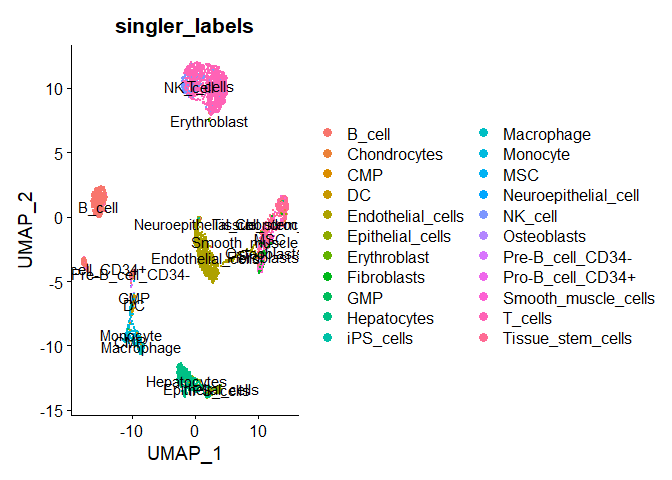
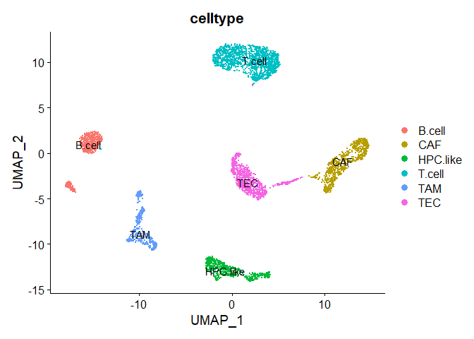

Basic Pipeline for scRNAseq Data Analysis: SingleR automatic cell annotation
================
Instructors : Somi Kim, Eunseo Park, Donggon Cha
2021/02/20

## load data

Seurat object should be loaded for automatic cell annotation.

To annotate cells automatically, we can use SingleR r package. Before performing SingleR, SingleCellExperiment (SCE) object is set with raw counts and normalized counts. Also, the Human Primary cell Atlas, represented as a **SummarizedExperiment** object containing a matrix of log-expression values with sample-level labels.

``` r
library(SingleR)
library(SingleCellExperiment)
library(dplyr)
library(Seurat)

sce <- SingleCellExperiment(list(counts = seurat@assays$RNA@counts,
                                 logcounts = seurat@assays$RNA@data))

hpca.se <- HumanPrimaryCellAtlasData()
hpca.se
```

    ## class: SummarizedExperiment 
    ## dim: 19363 713 
    ## metadata(0):
    ## assays(1): logcounts
    ## rownames(19363): A1BG A1BG-AS1 ... ZZEF1 ZZZ3
    ## rowData names(0):
    ## colnames(713): GSM112490 GSM112491 ... GSM92233 GSM92234
    ## colData names(3): label.main label.fine label.ont

We use **hpca.se** reference to annotate each cell in SCE object via the **SingleR()** function. By this function, marker genes are identified from the reference and based on the Spearman correlation across markers, assignment scores are computed for each cell. Each cell is annotated as the cell type label with the highest score.

``` r
pred.hesc <- SingleR(test = sce, ref = hpca.se, assay.type.test=1,
                     labels = hpca.se$label.main)
head(pred.hesc)
```

    ## DataFrame with 6 rows and 5 columns
    ##                                            scores      first.labels
    ##                                          <matrix>       <character>
    ## AAACCTGAGGCGTACA-1 0.183971:0.116038:0.104517:... Tissue_stem_cells
    ## AAACGGGAGATCGATA-1 0.222493:0.142291:0.137941:... Tissue_stem_cells
    ## AAAGCAAAGATCGGGT-1 0.275393:0.155992:0.149990:...       Fibroblasts
    ## AAATGCCGTCTCAACA-1 0.220968:0.133970:0.122140:... Tissue_stem_cells
    ## AACACGTCACGGCTAC-1 0.156163:0.138000:0.115655:... Endothelial_cells
    ## AACCGCGAGACGCTTT-1 0.289759:0.176489:0.156293:... Tissue_stem_cells
    ##                          tuning.scores              labels       pruned.labels
    ##                            <DataFrame>         <character>         <character>
    ## AAACCTGAGGCGTACA-1 0.1433232:0.0623682   Tissue_stem_cells   Tissue_stem_cells
    ## AAACGGGAGATCGATA-1 0.1010954:0.0346291   Tissue_stem_cells   Tissue_stem_cells
    ## AAAGCAAAGATCGGGT-1 0.0969523:0.0856622 Smooth_muscle_cells Smooth_muscle_cells
    ## AAATGCCGTCTCAACA-1 0.2313040:0.1259849   Tissue_stem_cells   Tissue_stem_cells
    ## AACACGTCACGGCTAC-1 0.2704928:0.2038585   Endothelial_cells   Endothelial_cells
    ## AACCGCGAGACGCTTT-1 0.3468541:0.2477355   Tissue_stem_cells   Tissue_stem_cells

The result performing SingleR is below.

``` r
table(pred.hesc$labels)
```

    ## 
    ##               B_cell         Chondrocytes                  CMP 
    ##                  649                   10                    1 
    ##                   DC    Endothelial_cells     Epithelial_cells 
    ##                   48                  885                  138 
    ##         Erythroblast          Fibroblasts                  GMP 
    ##                    4                   72                    5 
    ##          Hepatocytes            iPS_cells           Macrophage 
    ##                  480                    1                   96 
    ##             Monocyte                  MSC Neuroepithelial_cell 
    ##                  219                    3                    1 
    ##              NK_cell          Osteoblasts     Pre-B_cell_CD34- 
    ##                  133                    3                   20 
    ##     Pro-B_cell_CD34+  Smooth_muscle_cells              T_cells 
    ##                    3                  135                 1330 
    ##    Tissue_stem_cells 
    ##                  513

``` r
table(pred.hesc$labels) %>% sum()
```

    ## [1] 4749

``` r
identical(colnames(seurat), rownames(pred.hesc))
```

    ## [1] TRUE

To compare the automatic cell type annotation result with our manual cell type annotation, we assign the result labels to each cell in our **Seurat** object, and visualize them in UMAP plot. The results are below.

``` r
seurat$singler_labels = pred.hesc$labels

DimPlot(seurat, 
        reduction = "umap",
        group.by = "singler_labels", 
        label=TRUE)
```



``` r
DimPlot(seurat, 
        reduction = "umap",
        group.by = "celltype", 
        label=TRUE)
```



## Session information

``` r
sessionInfo()
```

    ## R version 4.0.2 (2020-06-22)
    ## Platform: x86_64-w64-mingw32/x64 (64-bit)
    ## Running under: Windows 10 x64 (build 19042)
    ## 
    ## Matrix products: default
    ## 
    ## locale:
    ## [1] LC_COLLATE=Korean_Korea.949  LC_CTYPE=Korean_Korea.949   
    ## [3] LC_MONETARY=Korean_Korea.949 LC_NUMERIC=C                
    ## [5] LC_TIME=Korean_Korea.949    
    ## 
    ## attached base packages:
    ## [1] parallel  stats4    stats     graphics  grDevices utils     datasets 
    ## [8] methods   base     
    ## 
    ## other attached packages:
    ##  [1] SeuratObject_4.0.0          Seurat_4.0.0               
    ##  [3] dplyr_1.0.4                 SingleCellExperiment_1.12.0
    ##  [5] SingleR_1.2.4               SummarizedExperiment_1.20.0
    ##  [7] Biobase_2.50.0              GenomicRanges_1.42.0       
    ##  [9] GenomeInfoDb_1.26.2         IRanges_2.24.1             
    ## [11] S4Vectors_0.28.1            BiocGenerics_0.36.0        
    ## [13] MatrixGenerics_1.2.1        matrixStats_0.58.0         
    ## 
    ## loaded via a namespace (and not attached):
    ##   [1] AnnotationHub_2.20.2          BiocFileCache_1.12.1         
    ##   [3] plyr_1.8.6                    igraph_1.2.6                 
    ##   [5] lazyeval_0.2.2                splines_4.0.2                
    ##   [7] BiocParallel_1.22.0           listenv_0.8.0                
    ##   [9] scattermore_0.7               ggplot2_3.3.3                
    ##  [11] digest_0.6.27                 htmltools_0.5.1.1            
    ##  [13] magrittr_2.0.1                memoise_2.0.0                
    ##  [15] tensor_1.5                    cluster_2.1.0                
    ##  [17] ROCR_1.0-11                   globals_0.14.0               
    ##  [19] colorspace_2.0-0              blob_1.2.1                   
    ##  [21] rappdirs_0.3.3                ggrepel_0.9.1                
    ##  [23] xfun_0.20                     crayon_1.4.0                 
    ##  [25] RCurl_1.98-1.2                jsonlite_1.7.2               
    ##  [27] spatstat_1.64-1               spatstat.data_1.7-0          
    ##  [29] survival_3.1-12               zoo_1.8-8                    
    ##  [31] glue_1.4.2                    polyclip_1.10-0              
    ##  [33] gtable_0.3.0                  zlibbioc_1.36.0              
    ##  [35] XVector_0.30.0                leiden_0.3.7                 
    ##  [37] DelayedArray_0.16.1           BiocSingular_1.4.0           
    ##  [39] future.apply_1.7.0            abind_1.4-5                  
    ##  [41] scales_1.1.1                  DBI_1.1.1                    
    ##  [43] miniUI_0.1.1.1                Rcpp_1.0.6                   
    ##  [45] viridisLite_0.3.0             xtable_1.8-4                 
    ##  [47] reticulate_1.18               bit_4.0.4                    
    ##  [49] rsvd_1.0.3                    htmlwidgets_1.5.3            
    ##  [51] httr_1.4.2                    RColorBrewer_1.1-2           
    ##  [53] ellipsis_0.3.1                ica_1.0-2                    
    ##  [55] farver_2.0.3                  pkgconfig_2.0.3              
    ##  [57] uwot_0.1.10                   dbplyr_2.0.0                 
    ##  [59] deldir_0.2-9                  tidyselect_1.1.0             
    ##  [61] labeling_0.4.2                rlang_0.4.10                 
    ##  [63] reshape2_1.4.4                later_1.1.0.1                
    ##  [65] AnnotationDbi_1.50.3          munsell_0.5.0                
    ##  [67] BiocVersion_3.11.1            tools_4.0.2                  
    ##  [69] cachem_1.0.1                  generics_0.1.0               
    ##  [71] RSQLite_2.2.3                 ExperimentHub_1.14.2         
    ##  [73] ggridges_0.5.3                evaluate_0.14                
    ##  [75] stringr_1.4.0                 fastmap_1.1.0                
    ##  [77] yaml_2.2.1                    goftest_1.2-2                
    ##  [79] knitr_1.31                    bit64_4.0.5                  
    ##  [81] fitdistrplus_1.1-3            purrr_0.3.4                  
    ##  [83] RANN_2.6.1                    pbapply_1.4-3                
    ##  [85] future_1.21.0                 nlme_3.1-148                 
    ##  [87] mime_0.9                      compiler_4.0.2               
    ##  [89] plotly_4.9.3                  curl_4.3                     
    ##  [91] png_0.1-7                     interactiveDisplayBase_1.26.3
    ##  [93] spatstat.utils_2.0-0          tibble_3.0.6                 
    ##  [95] stringi_1.5.3                 highr_0.8                    
    ##  [97] lattice_0.20-41               Matrix_1.2-18                
    ##  [99] vctrs_0.3.6                   pillar_1.4.7                 
    ## [101] lifecycle_0.2.0               BiocManager_1.30.10          
    ## [103] lmtest_0.9-38                 RcppAnnoy_0.0.18             
    ## [105] BiocNeighbors_1.6.0           data.table_1.13.6            
    ## [107] cowplot_1.1.1                 bitops_1.0-6                 
    ## [109] irlba_2.3.3                   httpuv_1.5.5                 
    ## [111] patchwork_1.1.1               R6_2.5.0                     
    ## [113] promises_1.1.1                KernSmooth_2.23-18           
    ## [115] gridExtra_2.3                 parallelly_1.23.0            
    ## [117] codetools_0.2-16              MASS_7.3-51.6                
    ## [119] assertthat_0.2.1              withr_2.4.1                  
    ## [121] sctransform_0.3.2             GenomeInfoDbData_1.2.4       
    ## [123] mgcv_1.8-31                   grid_4.0.2                   
    ## [125] rpart_4.1-15                  tidyr_1.1.2                  
    ## [127] rmarkdown_2.6                 DelayedMatrixStats_1.10.1    
    ## [129] Rtsne_0.15                    shiny_1.6.0

## References

L. Ma, M.O. Hernandez, Y. Zhao, M. Mehta, B. Tran, M. Kelly, Z. Rae, J.M. Hernandez, J.L. Davis, S.P. Martin, D.E. Kleiner, S.M. Hewitt, K. Ylaya, B.J. Wood, T.F. Greten, X.W. Wang. Tumor cell biodiversity drives microenvironmental reprogramming in liver cancer. Canc. Cell, 36 (4): 418-430 (2019)

Aran, D., Looney, A. P., Liu, L., Wu, E., Fong, V., Hsu, A., ... & Bhattacharya, M. (2019). Reference-based analysis of lung single-cell sequencing reveals a transitional profibrotic macrophage. Nature immunology, 20(2), 163-172.

Mabbott, N.A., Baillie, J.K., Brown, H. et al. An expression atlas of human primary cells: inference of gene function from coexpression networks. BMC Genomics 14, 632 (2013), 14-632.
