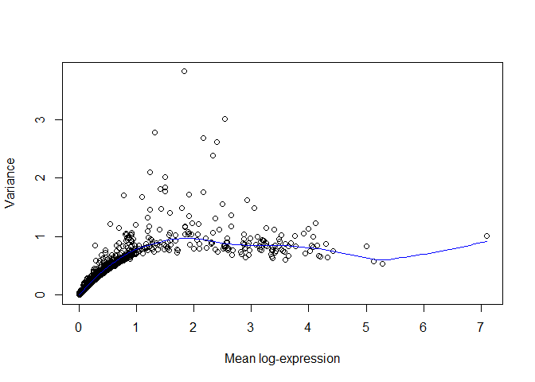
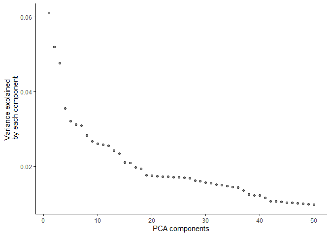
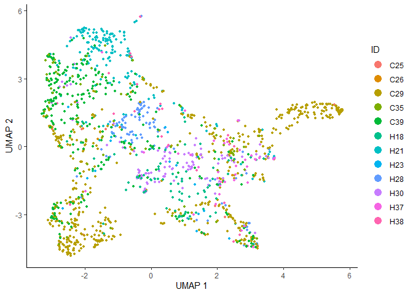
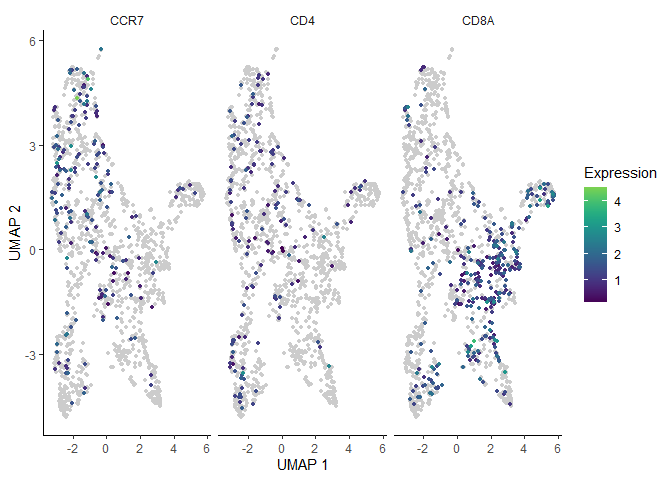

Basic Pipeline for scRNAseq Data Analysis: Trajectory Analysis
================
Instructors : Somi Kim, Eunseo Park, Donggon Cha
2021/02/20

## Preprocessing

### Extracting Specific Cell Type

After specifying cell types, it is able to extract specific cells for further analysis. For efficient downstream analysis, genes without detected UMIs which has values of zeros is removed.

``` r
#extract T cell population
seurat_t <- seurat[, seurat$celltype == "T.cell"]
seurat_t <- seurat_t[rowSums(seurat_t@assays$RNA@counts) != 0, ]
```

Since the population of interest is changed specifically into T cells, expression data is normalized again in cell-level.

``` r
sce_t <- as.SingleCellExperiment(seurat_t)

clusters <- quickCluster(sce_t)
sce_t <- computeSumFactors(sce_t, clusters = clusters)
sce_t <- logNormCounts(sce_t)
```

Highly variable genes are also changed specifically in T cell population.

``` r
#HVG selection for T cell
dec <- modelGeneVar(sce_t)
plot(dec$mean, dec$total, xlab="Mean log-expression", ylab="Variance")
curve(metadata(dec)$trend(x), col="blue", add=TRUE)
```



``` r
hvg.t <- getTopHVGs(dec, fdr.threshold = 0.05)
length(hvg.t) # 200 genes
```

    ## [1] 200

## Trajectory Analysis

Here, we will infer the trajectory of extracted T cell population, using **monocle3** package.

### Generate CDS Object

It uses differently structured object named **cell\_data\_set (cds)**, so normalized expressions, metadata for cells, and metadata for genes shoud be recombined for creating **cds**.

``` r
library(monocle3)
cell_metadata = colData(sce_t)
gene_metadata = data.frame(gene_short_name = rownames(sce_t), row.names = rownames(sce_t))

cds <- new_cell_data_set(sce_t@assays@data$logcounts,
                         cell_metadata = cell_metadata,
                         gene_metadata = gene_metadata) # generate cell_data_set object
```

### Dimension reduction for CDS Object

**monocle3** also allows dimension reduction using hvgs. As we import normalized count in **cds** object, we preprocess the object without additional normalization.

``` r
cds <- preprocess_cds(cds, "PCA", num_dim = 50, norm_method = "none", use_genes = hvg.t)
monocle3::plot_pc_variance_explained(cds)
```



``` r
cds <- reduce_dimension(cds, reduction_method = "UMAP")
plot_cells(cds, color_cells_by = "ID", cell_size = 1, group_label_size = 5)
```


### Correcting Batch Effects

As we observe batch effects above, they should be corrected before further trajectory analysis. Here we perform **Mutual Nearest Neighbor (MNN) batch effect correction** implemented **batchelor**, which is included in **monocle3** package.

``` r
cds_aligned <- preprocess_cds(cds, "PCA", num_dim = 30, norm_method = "none", use_genes = hvg.t)
cds_aligned <- align_cds(cds_aligned, alignment_group = "ID") #batch correction
cds_aligned <- reduce_dimension(cds_aligned, preprocess_method = "Aligned")
plot_cells(cds_aligned,
           color_cells_by = "ID",
           cell_size = 1,
           label_cell_groups = FALSE)
```



### Clustering and Trajectory Inference

Known markers genes allows us to check the brief estimated trajectory, and to compare a trajectory after further analysis. We bring naive (CCR7), CD4, and CD8 T cell marker expressions.

``` r
plot_cells(cds_aligned,
           genes = c("CCR7", "CD4", "CD8A"),
           cell_size = 1,
           norm_method = "size_only")
```



Further clustering and trajectory inference can be done by functions below. Clustering by **cluster\_cells()** is **resolution**-sensitive, and the clustering result affects further trajectory lines calculated by **learn\_graph()**. By specifying the starting node of the learned graph from the interactive user interfaces after running **order\_cells()**, pseudotime is calculated.

``` r
cds_aligned <- cluster_cells(cds_aligned, resolution = 0.001)
cds_aligned <- learn_graph(cds_aligned)
cds_aligned <- order_cells(cds_aligned)
```

Estimated clusters, trajectory, and pseudotimesis plotted as below.

``` r
plot_cells(cds_aligned,
           color_cells_by = "cluster",
           cell_size = 1,
           group_label_size = 5,
           label_leaves = FALSE,
           label_branch_points = FALSE)
```


``` r
plot_cells(cds_aligned,
           color_cells_by = "pseudotime",
           cell_size = 1,
           label_groups_by_cluster = FALSE,
           label_leaves = FALSE,
           label_branch_points = FALSE)
```


## Session information

``` r
sessionInfo()
```

    ## R version 4.0.2 (2020-06-22)
    ## Platform: x86_64-w64-mingw32/x64 (64-bit)
    ## Running under: Windows 10 x64 (build 19042)
    ## 
    ## Matrix products: default
    ## 
    ## locale:
    ## [1] LC_COLLATE=Korean_Korea.949  LC_CTYPE=Korean_Korea.949   
    ## [3] LC_MONETARY=Korean_Korea.949 LC_NUMERIC=C                
    ## [5] LC_TIME=Korean_Korea.949    
    ## 
    ## attached base packages:
    ## [1] parallel  stats4    stats     graphics  grDevices utils     datasets 
    ## [8] methods   base     
    ## 
    ## other attached packages:
    ##  [1] monocle3_0.2.3.0            SeuratObject_4.0.0         
    ##  [3] Seurat_4.0.0                scran_1.16.0               
    ##  [5] scater_1.16.2               SingleCellExperiment_1.12.0
    ##  [7] SummarizedExperiment_1.20.0 Biobase_2.50.0             
    ##  [9] GenomicRanges_1.42.0        GenomeInfoDb_1.26.2        
    ## [11] IRanges_2.24.1              S4Vectors_0.28.1           
    ## [13] BiocGenerics_0.36.0         MatrixGenerics_1.2.1       
    ## [15] matrixStats_0.58.0          ggplot2_3.3.3              
    ## 
    ## loaded via a namespace (and not attached):
    ##   [1] plyr_1.8.6                igraph_1.2.6             
    ##   [3] lazyeval_0.2.2            splines_4.0.2            
    ##   [5] BiocParallel_1.22.0       listenv_0.8.0            
    ##   [7] scattermore_0.7           digest_0.6.27            
    ##   [9] htmltools_0.5.1.1         viridis_0.5.1            
    ##  [11] magrittr_2.0.1            tensor_1.5               
    ##  [13] cluster_2.1.0             ROCR_1.0-11              
    ##  [15] limma_3.44.3              globals_0.14.0           
    ##  [17] colorspace_2.0-0          ggrepel_0.9.1            
    ##  [19] xfun_0.20                 dplyr_1.0.4              
    ##  [21] crayon_1.4.0              RCurl_1.98-1.2           
    ##  [23] jsonlite_1.7.2            spatstat_1.64-1          
    ##  [25] spatstat.data_1.7-0       survival_3.1-12          
    ##  [27] zoo_1.8-8                 glue_1.4.2               
    ##  [29] polyclip_1.10-0           gtable_0.3.0             
    ##  [31] zlibbioc_1.36.0           XVector_0.30.0           
    ##  [33] leiden_0.3.7              DelayedArray_0.16.1      
    ##  [35] BiocSingular_1.4.0        future.apply_1.7.0       
    ##  [37] abind_1.4-5               scales_1.1.1             
    ##  [39] DBI_1.1.1                 edgeR_3.30.3             
    ##  [41] miniUI_0.1.1.1            Rcpp_1.0.6               
    ##  [43] viridisLite_0.3.0         xtable_1.8-4             
    ##  [45] reticulate_1.18           dqrng_0.2.1              
    ##  [47] proxy_0.4-24              rsvd_1.0.3               
    ##  [49] htmlwidgets_1.5.3         httr_1.4.2               
    ##  [51] RColorBrewer_1.1-2        ellipsis_0.3.1           
    ##  [53] ica_1.0-2                 farver_2.0.3             
    ##  [55] pkgconfig_2.0.3           uwot_0.1.10              
    ##  [57] deldir_0.2-9              locfit_1.5-9.4           
    ##  [59] labeling_0.4.2            tidyselect_1.1.0         
    ##  [61] rlang_0.4.10              reshape2_1.4.4           
    ##  [63] later_1.1.0.1             munsell_0.5.0            
    ##  [65] tools_4.0.2               generics_0.1.0           
    ##  [67] ggridges_0.5.3            batchelor_1.4.0          
    ##  [69] evaluate_0.14             stringr_1.4.0            
    ##  [71] fastmap_1.1.0             yaml_2.2.1               
    ##  [73] goftest_1.2-2             knitr_1.31               
    ##  [75] fitdistrplus_1.1-3        purrr_0.3.4              
    ##  [77] RANN_2.6.1                pbapply_1.4-3            
    ##  [79] future_1.21.0             nlme_3.1-148             
    ##  [81] mime_0.9                  compiler_4.0.2           
    ##  [83] beeswarm_0.2.3            plotly_4.9.3             
    ##  [85] png_0.1-7                 spatstat.utils_2.0-0     
    ##  [87] tibble_3.0.6              statmod_1.4.35           
    ##  [89] stringi_1.5.3             highr_0.8                
    ##  [91] RSpectra_0.16-0           lattice_0.20-41          
    ##  [93] Matrix_1.2-18             vctrs_0.3.6              
    ##  [95] pillar_1.4.7              lifecycle_0.2.0          
    ##  [97] lmtest_0.9-38             RcppAnnoy_0.0.18         
    ##  [99] BiocNeighbors_1.6.0       data.table_1.13.6        
    ## [101] cowplot_1.1.1             bitops_1.0-6             
    ## [103] irlba_2.3.3               httpuv_1.5.5             
    ## [105] patchwork_1.1.1           R6_2.5.0                 
    ## [107] promises_1.1.1            KernSmooth_2.23-18       
    ## [109] gridExtra_2.3             vipor_0.4.5              
    ## [111] parallelly_1.23.0         codetools_0.2-16         
    ## [113] MASS_7.3-51.6             assertthat_0.2.1         
    ## [115] leidenbase_0.1.2          withr_2.4.1              
    ## [117] sctransform_0.3.2         GenomeInfoDbData_1.2.4   
    ## [119] mgcv_1.8-31               grid_4.0.2               
    ## [121] rpart_4.1-15              tidyr_1.1.2              
    ## [123] rmarkdown_2.6             DelayedMatrixStats_1.10.1
    ## [125] Rtsne_0.15                shiny_1.6.0              
    ## [127] ggbeeswarm_0.6.0

## References

L. Ma, M.O. Hernandez, Y. Zhao, M. Mehta, B. Tran, M. Kelly, Z. Rae, J.M. Hernandez, J.L. Davis, S.P. Martin, D.E. Kleiner, S.M. Hewitt, K. Ylaya, B.J. Wood, T.F. Greten, X.W. Wang. Tumor cell biodiversity drives microenvironmental reprogramming in liver cancer. Canc. Cell, 36 (4): 418-430 (2019)

Lun, A. T. L. et al. EmptyDrops: distinguishing cells from empty droplets in droplet-based single-cell RNA sequencing data. Genome Biol. 20, 63 (2019)

McCarthy, D. J., Campbell, K. R., Lun, A. T. & Wills, Q. F. Scater: pre-processing, quality control, normalization and visualization of single-cell RNA-seq data in R. Bioinformatics 33, 1179–1186 (2017)

Lun, A. T., McCarthy, D. J. & Marioni, J. C. A step-by-step workflow for low-level analysis of single-cell RNA-seq data with Bioconductor. F1000Res 5, 2122 (2016).

Butler, A., Hoffman, P., Smibert, P., Papalexi, E. & Satija, R. Integrating single-cell transcriptomic data across different conditions, technologies, and species. Nat. Biotechnol. 36, 411–420 (2018).

Cao, J. et al. The single-cell transcriptional landscape of mammalian organogenesis. Nature 566, 496–502 (2019).

Haghverdi L, Lun ATL, Morgan MD, Marioni JC (2018). 'Batch effects in single-cell RNA-sequencing data are corrected by matching mutual nearest neighbors.' Nat. Biotechnol., 36(5), 421-427. doi: 10.1038/nbt.4091
