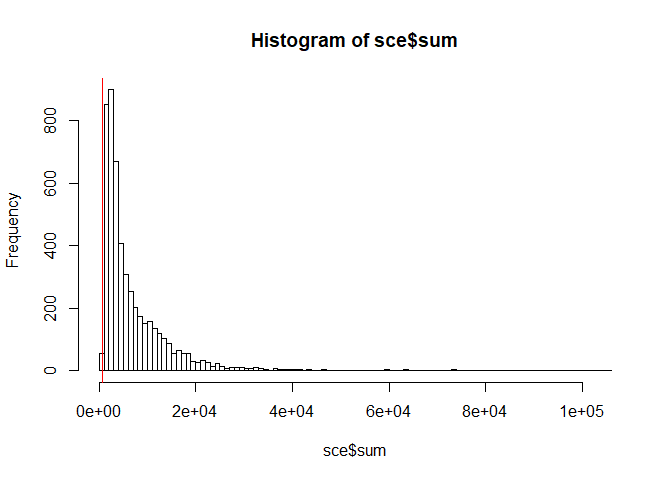
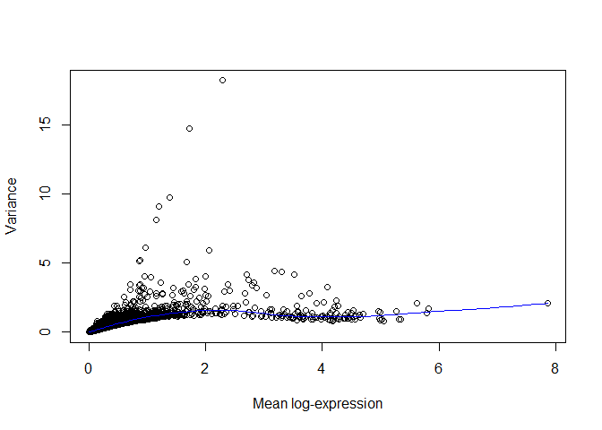
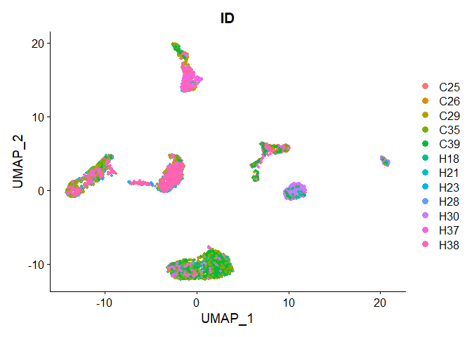
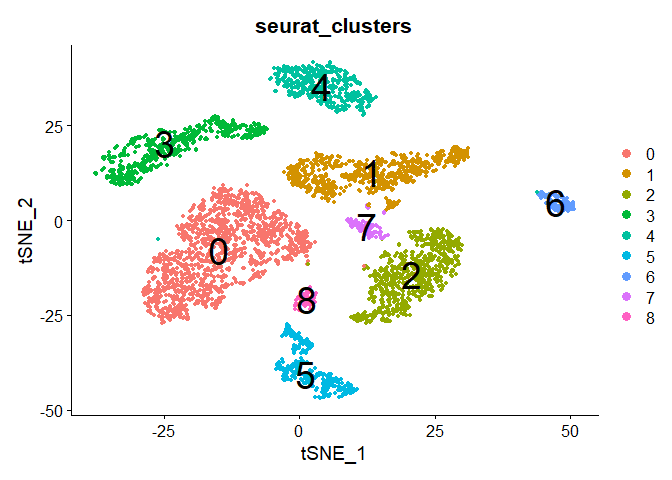
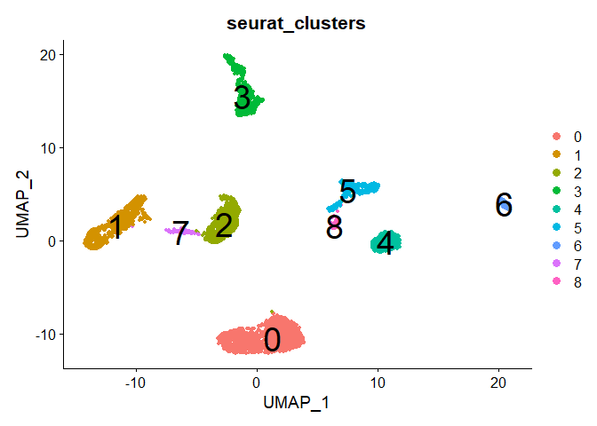
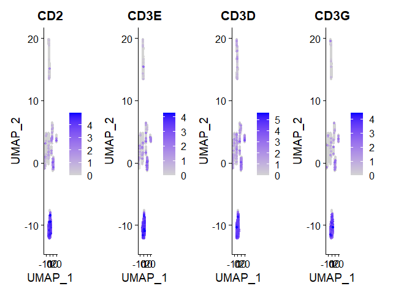
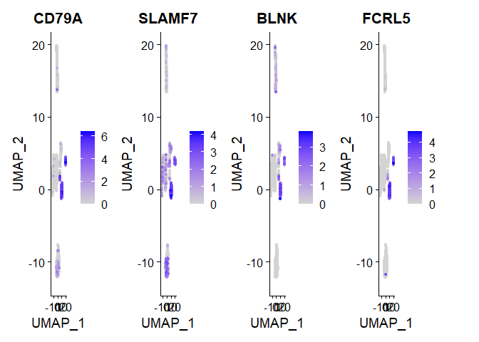
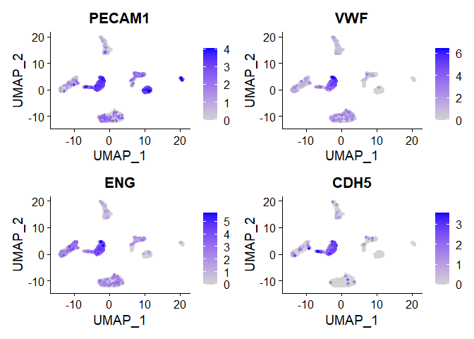
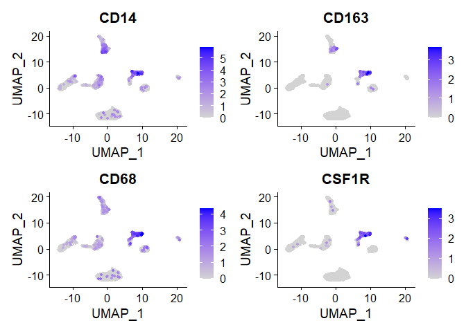
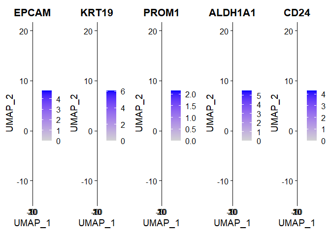

Basic Pipeline for scRNAseq Data Analysis
================
Instructors : Somi Kim, Eunseo Park, Donggon Cha
2021/02/20

# Introduction

# Quality Control (Cell / Gene QC)

## Empty droplet filtering

## Removal of low quality cells

To preprocess liver cancer scRNA-seq data, basic information of each
cell of experimental design is necessary. Given sample information is
loaded and organized. First, we set sample ID per each patient from its
sample name to include liver cancer subtype information. We also set
Diagnosis as liver cancer subtypes which are HCC or iCCA in this data.

``` r
library(DropletUtils)
library(dplyr)
library(scater)

dir = "E:/Project/KOGO_2021/rawdata"

sampleInfo <- read.table(paste0(dir, "/samples.txt"), header=TRUE, sep="\t")
head(sampleInfo)

sampleInfo$ID <- sapply(sampleInfo$Sample %>% as.character(), function(x) {strsplit(x, split="_")[[1]][3]}) 
sampleInfo$ID <- gsub("LCP", "", sampleInfo$ID)

orig.ids = sampleInfo$ID %>% as.factor() %>% levels()
new.ids = c("H18", "H21", "H23", "C25", "C26", "H28", 
            "C29", "H30", "C35", "H37", "H38", "C39")

for(i in orig.ids){
  new.id = new.ids[grep(i, new.ids)]
  sampleInfo[grep(i, sampleInfo$ID),]$ID = new.id
}
sampleInfo$Diagnosis = sampleInfo$ID
for(i in c("H", "C")){
  if(i == "H"){
    sampleInfo[grep(i, sampleInfo$ID),]$Diagnosis = "HCC"
  }else{
    sampleInfo[grep(i, sampleInfo$ID),]$Diagnosis = "iCCA"
  }
}
```

For preprocessing of scRNA-seq data, mapped reads are loaded as a
**Singlecellexperiment (SCE)** object by read10XCounts() of
**DropletUtils** R package. A SCE object contains a **gene-by-cell count
matrix**, **gene data** (gene annotation, etc) and **cell data** (sample
information, experimental condition information, etc). Gene information
will be stored in rowData(SCE), and cell information is stored in
colData(SCE). A gene-by-cell matrix will be stored as a sparse matrix in
a SCE object. Ensembl gene ids is transformed into gene symbol for
eaiser further analysis. In colData(sce), Sample name, cancer histologic
subtypes (Diagnosis), sample ID, cell type information (from the
literature) is stored.

``` r
sce <- read10xCounts(
  samples = dir,
  type="sparse",
  col.names = TRUE
)
rownames(sce) = uniquifyFeatureNames(rowData(sce)$ID, rowData(sce)$Symbol)

sce$Sample = sampleInfo$Sample
sce$Diagnosis = sampleInfo$Diagnosis
sce$ID = sampleInfo$ID
sce$Type = sampleInfo$Type

sce
```

    ## class: SingleCellExperiment 
    ## dim: 20124 5115 
    ## metadata(1): Samples
    ## assays(1): counts
    ## rownames(20124): RP11-34P13.7 FO538757.2 ... AC233755.1 AC240274.1
    ## rowData names(2): ID Symbol
    ## colnames(5115): AAACCTGAGGCGTACA-1 AAACGGGAGATCGATA-1 ...
    ##   TTTATGCTCCTTAATC-13 TTTGTCAGTTTGGGCC-13
    ## colData names(5): Sample Barcode Diagnosis ID Type
    ## reducedDimNames(0):
    ## spikeNames(0):
    ## altExpNames(0):

To remove low quality cells, several values such as number of unique
molecular identifiers (UMIs) per cell, number of genes detected per
cell, the percentage of UMIs assigned to mitochondrial (MT) genes were
calculated using **addPerCellQC()** of **scater** R package. We defined
poor quality cells with \< 700 UMIs and \> 20% of UMIs assigned to MT
genes and excluded them. Criteria can be visualized as histograms as
below.

``` r
library(scater)

mtgenes = rowData(sce)[grep("MT-", rowData(sce)$Symbol),]$Symbol
is.mito = rownames(sce) %in% mtgenes
table(is.mito)
```

    ## is.mito
    ## FALSE  TRUE 
    ## 20111    13

``` r
sce <- addPerCellQC(
  sce,
  subsets = list(MT=mtgenes),
  percent_top = c(50, 100, 200, 500), 
  detection.limit = 5
)

sce$log10_sum = log10(sce$sum + 1)
sce$log10_detected = log10(sce$detected + 1)

umi = 700
mtpct = 20

hist(sce$sum, breaks = 100)
abline(v = umi, col="red")
```



``` r
hist(sce$subsets_MT_percent, breaks=100)
abline(v=mtpct, col="red")
```


``` r
filter_by_total_counts = sce$sum > umi
filter_by_mt_percent = sce$subsets_MT_percent < mtpct

sce$use <- (
  filter_by_total_counts &
    filter_by_mt_percent 
)

sce = sce[,sce$use]
```

# Basic Pipeline

After quality control, basic processes including normalization, feature
selection and visualization is performed.

## Normalization

To remove cell-specific biases, cells were clustered using
**quickCluster()** and cell-specific size factors are calculated using
**computeSumFactors()** of **scran** R package. Raw counts of each cell
are divided by cell-specific size factor and **log2-transformed** with a
pseudocount of 1.

``` r
library(scran)

clusters <- quickCluster(sce)
sce <- computeSumFactors(sce, clusters = clusters)
print(summary(sizeFactors(sce)))
```

    ##     Min.  1st Qu.   Median     Mean  3rd Qu.     Max. 
    ##  0.09539  0.32598  0.54100  1.00000  1.06519 15.19534

``` r
sce.norm <- logNormCounts(sce, pseudo_count = 1)
```

## Feature Selection

To find genes contain useful information about the biology of the data,
highly variable genes (HVGs) are defined by selecting the most variable
genes based on their expression across cells. Genes with **\< 0.05 of
false discovery rate (FDR)** were identified as HVGs.

``` r
dec <- modelGeneVar(sce.norm)
plot(dec$mean, dec$total, xlab="Mean log-expression", ylab="Variance")
curve(metadata(dec)$trend(x), col="blue", add=TRUE)
```



``` r
hvg.norm <- getTopHVGs(dec, fdr.threshold = 0.05)
length(hvg.norm) # 551 genes
```

    ## [1] 551

## Dimension Reduction

For downstream analysis, we create Seurat object containing raw and
normalized gene-by-cell count matrices. Column data (cell information)
is preserved. Normalized data is scaled and principal components (PCs)
are calculated by a gene-by-cell matrix with HVGs.

``` r
library(Seurat)

seurat <- as.Seurat(sce.norm,
                    counts = "counts",
                    data = "logcounts",
                    assay = "RNA")
VariableFeatures(seurat) = hvg.norm

all.genes = rownames(seurat)
seurat <- ScaleData(seurat, features = all.genes)

seurat <- RunPCA(seurat,
                 assay = "RNA",
                 npcs = 50,
                 features = hvg.norm,
                 reduction.key = "pca_",
                 verbose = FALSE)
plot((seurat@reductions$pca@stdev)^2,
     xlab = "PC",
     ylab = "Eigenvalue")
```


We set to 15 PCs for clustering and visualization. After clustering and
visualization, cells are plotted in the two-dimensional TSNE or UMAP
plot and cell information can be also shown.

``` r
PCA=15

seurat <- FindNeighbors(seurat, dims=1:PCA)
seurat <- FindClusters(seurat, resolution = 0.8)
```

    ## Modularity Optimizer version 1.3.0 by Ludo Waltman and Nees Jan van Eck
    ## 
    ## Number of nodes: 4749
    ## Number of edges: 156013
    ## 
    ## Running Louvain algorithm...
    ## Maximum modularity in 10 random starts: 0.9133
    ## Number of communities: 19
    ## Elapsed time: 0 seconds

``` r
seurat <- RunTSNE(seurat, dims = 1:PCA)
seurat <- RunUMAP(seurat, dims = 1:PCA)

TSNEPlot(seurat, group.by = "ID", pt.size = 1)
```


``` r
UMAPPlot(seurat, group.by = "ID", pt.size = 1)
```


## Batch Correction

On the previous TSNE (or UMAP) plot, batch effect is shown. Batch effect
is removed using **RunHarmony()** in **Harmony** R package. After using
RunHarmony(), it returns a Seurat object, updated with the corrected
Harmony coordinates. Using the corrected Harmony coordinates, clustering
and visualization are processed same as before batch correction.

``` r
library(harmony)

seurat <- RunHarmony(seurat, "ID", plot_convergence = TRUE)
```


``` r
nComp = 15
seurat <- FindNeighbors(seurat, 
                        reduction = "harmony",
                        dims=1:nComp)
seurat <- FindClusters(seurat, resolution = 0.2)
```

    ## Modularity Optimizer version 1.3.0 by Ludo Waltman and Nees Jan van Eck
    ## 
    ## Number of nodes: 4749
    ## Number of edges: 175420
    ## 
    ## Running Louvain algorithm...
    ## Maximum modularity in 10 random starts: 0.9643
    ## Number of communities: 9
    ## Elapsed time: 0 seconds

``` r
seurat <- RunTSNE(seurat,
                  reduction = "harmony",
                  dims = 1:nComp,
                  check_duplicates = FALSE)
seurat <- RunUMAP(seurat,
                  reduction = "harmony",
                  dims = 1:nComp)

DimPlot(seurat, reduction = "umap", group.by = "ID", pt.size = 1)
```



``` r
DimPlot(seurat, reduction = "tsne", group.by = "ID", pt.size = 1)
```


``` r
DimPlot(seurat, reduction = "tsne", group.by = "seurat_clusters", pt.size=1, label=TRUE, label.size=10)
```



``` r
DimPlot(seurat, reduction = "umap", group.by = "seurat_clusters", pt.size=1, label=TRUE, label.size=10)
```



## Identification of cell types

``` r
library(ggplot2)
library(pheatmap)
library(RColorBrewer)

markers = list(
  T.cells = c("CD2", "CD3E", "CD3D", "CD3G"), #cluster 0
  B.cells = c("CD79A", "SLAMF7", "BLNK", "FCRL5"), #cluster 4,6
  TECs = c("PECAM1", "VWF", "ENG", "CDH5"), #cluster 2,7
  CAFs = c("COL1A2", "FAP", "PDPN", "DCN", "COL3A1", "COL6A1"), #cluster 1
  TAMs = c("CD14", "CD163", "CD68", "CSF1R"), #cluster 5,8
  HPC.like = c("EPCAM", "KRT19", "PROM1", "ALDH1A1", "CD24") #cluster 3
)
```

Expression patterns of cell-type specific marker genes are shown below.

``` r
FeaturePlot(seurat,
            features = markers$T.cells,
            order = T,
            pt.size = 1,
            ncol = 6)
```



``` r
FeaturePlot(seurat,
            features = markers$B.cells,
            order = T,
            pt.size = 1,
            ncol = 6)
```



``` r
FeaturePlot(seurat,
            features = markers$TECs,
            order = T,
            pt.size = 1,
            ncol = 6)
```



``` r
FeaturePlot(seurat,
            features = markers$CAFs,
            order = T,
            pt.size = 1,
            ncol = 6)
```


``` r
FeaturePlot(seurat,
            features = markers$TAMs,
            order = T,
            pt.size = 1,
            ncol = 6)
```



``` r
FeaturePlot(seurat,
            features = markers$HPC.like,
            order = T,
            pt.size = 1,
            ncol = 6)
```



``` r
avgExprs <- AverageExpression(seurat,
                              features = unlist(markers),
                              assays = "RNA", slot = "data")

scaledExprs <- t(scale(t(avgExprs$RNA)))
scaledExprs[scaledExprs > -min(scaledExprs)] <- -min(scaledExprs)

palette_length = 100
my_color = colorRampPalette(rev(brewer.pal(11, "RdBu")))(palette_length)

my_breaks <- c(seq(min(scaledExprs), 0,
                   length.out=ceiling(palette_length/2) + 1),
               seq(max(scaledExprs)/palette_length,
                   max(scaledExprs),
                   length.out=floor(palette_length/2)))

pheatmap(scaledExprs,
         cluster_cols = T, cluster_rows = F, clustering_method = "ward.D2",
         treeheight_col = 0,
         breaks = my_breaks, color=my_color,
         labels_row = as.expression(lapply(rownames(scaledExprs), function(a) bquote(italic(.(a))))),
         angle_col = 315
)
```


``` r
seurat$celltype = seurat$seurat_clusters

seurat$celltype = gsub(0, "T.cell", seurat$celltype)
seurat$celltype = gsub(1, "CAF", seurat$celltype)
seurat$celltype = gsub(2, "TEC", seurat$celltype)
seurat$celltype = gsub(3, "HPC.like", seurat$celltype)
seurat$celltype = gsub(4, "B.cell", seurat$celltype)
seurat$celltype = gsub(5, "TAM", seurat$celltype)
seurat$celltype = gsub(6, "B.cell", seurat$celltype)
seurat$celltype = gsub(7, "TEC", seurat$celltype)
seurat$celltype = gsub(8, "TAM", seurat$celltype)

DimPlot(seurat, 
        reduction="tsne", 
        group.by="celltype",
        pt.size = 1)
```


