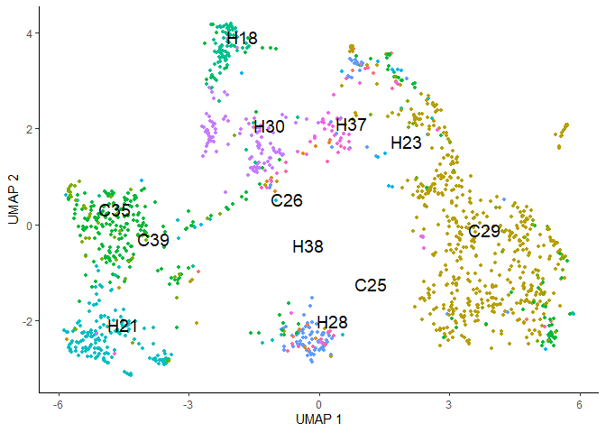
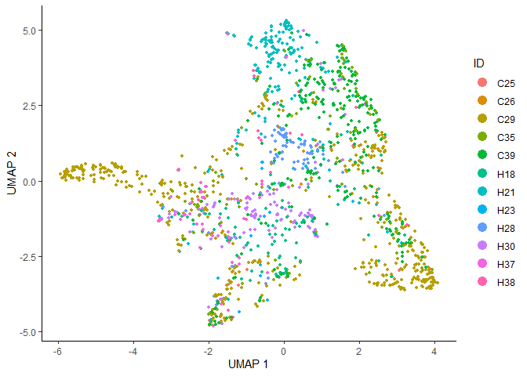
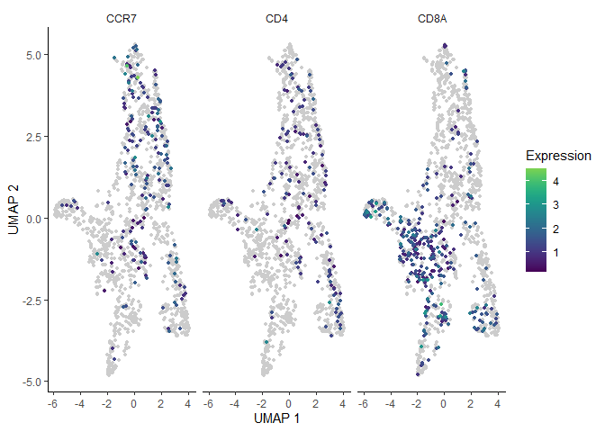
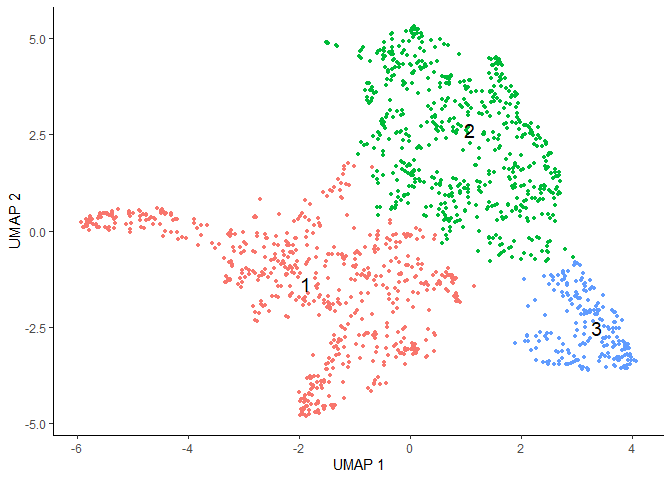
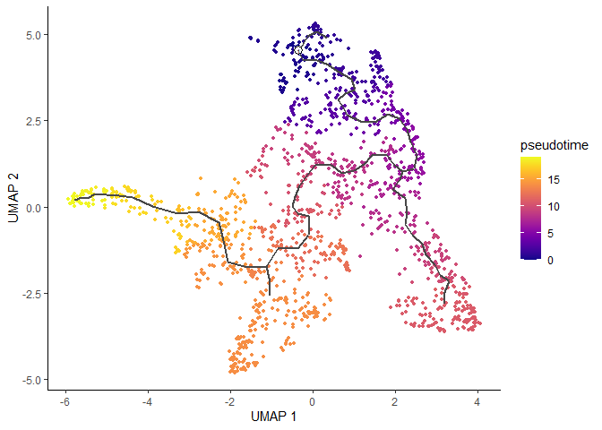

Basic Pipeline for scRNAseq Data Analysis: Trajectory Analysis
================
Instructors : Somi Kim, Eunseo Park, Donggon Cha
2021/02/20

## Extracting Specific Cell Type

By specifying the names of cells in interest, they can be separated. For
further analysis, genes without detected UMIs from extracted cells can
be removed.

``` r
#extract T cell population
seurat_t <- seurat[, seurat$celltype == "T cell"]
seurat_t <- seurat_t[rowSums(seurat_t@assays$RNA@counts) != 0, ]
```

As the cell population is extracted, expression levels should be
normalized again in cell-level.

``` r
sce_t <- as.SingleCellExperiment(seurat_t)

clusters <- quickCluster(sce_t)
sce_t <- computeSumFactors(sce_t, clusters = clusters)
sce_t <- logNormCounts(sce_t)
```

And highly variable genes will also be changed.

``` r
#HVG selection for T cell
dec <- modelGeneVar(sce_t)
plot(dec$mean, dec$total, xlab="Mean log-expression", ylab="Variance")
curve(metadata(dec)$trend(x), col="blue", add=TRUE)
```

<!-- -->

``` r
hvg.t <- getTopHVGs(dec, fdr.threshold = 0.05)
length(hvg.t) # 200 genes
```

    ## [1] 200

## Trajectory Analysis

Here, we will infer the trajectory of extracted T cell population, using
**monocle3** package.

### Generate CDS Object

It uses differently structured object named **cell\_data\_set (cds)**,
so normalized expressions, metadata for cells, and metadata for genes
shoud be recombined for creating **cds**.

``` r
library(monocle3)
cell_metadata = colData(sce_t)
gene_metadata = data.frame(gene_short_name = rownames(sce_t), row.names = rownames(sce_t))

cds <- new_cell_data_set(sce_t@assays@data$logcounts,
                         cell_metadata = cell_metadata,
                         gene_metadata = gene_metadata) # generate cell_data_set object
```

### Dimension reduction for CDS Object

**monocle3** also allows dimension reduction using hvgs. As we imported
normalized count in **cds** object, we will preprocess the object
without additional
normalization.

``` r
cds <- preprocess_cds(cds, "PCA", num_dim = 50, norm_method = "none", use_genes = hvg.t)
monocle3::plot_pc_variance_explained(cds)
```

<!-- -->

``` r
cds <- reduce_dimension(cds, reduction_method = "UMAP")
plot_cells(cds, color_cells_by = "ID", cell_size = 1, group_label_size = 5)
```

<!-- -->

### Correcting Batch Effects

As we observed batch effects above, they should be corrected before
further trajectory analysis. Here we perform **Mutual Nearest Neighbor
(MNN) batch effect correction** implemented **batchelor**, which is
included in **monocle3**
package.

``` r
cds_aligned <- preprocess_cds(cds, "PCA", num_dim = 30, norm_method = "none", use_genes = hvg.t)
cds_aligned <- align_cds(cds_aligned, alignment_group = "ID") #batch correction
cds_aligned <- reduce_dimension(cds_aligned, preprocess_method = "Aligned")
plot_cells(cds_aligned,
           color_cells_by = "ID",
           cell_size = 1,
           label_cell_groups = FALSE)
```

<!-- -->

### Clustering and Trajectory Inference

Known markers genes allows us to check the brief estimated trajectory,
and to compare a trajectory after further analysis. Here we brought
naive (CCR7), CD4, and CD8 T cell marker expressions.

``` r
plot_cells(cds_aligned,
           genes = c("CCR7", "CD4", "CD8A"),
           cell_size = 1,
           norm_method = "size_only")
```

<!-- -->

Further clustering and trajectory inference can be done by functions
below. Clustering by **cluster\_cells()** is **resolution**-sensitive,
and the clustering result affects further trajectory lines calculated by
**learn\_graph()**. By specifying the starting node of the learned graph
from the interactive user interfaces after running **order\_cells()**,
pseudotime will be calculated.

``` r
cds_aligned <- cluster_cells(cds_aligned, resolution = 0.001)
cds_aligned <- learn_graph(cds_aligned)
cds_aligned <- order_cells(cds_aligned)
```

Estimated clusters, trajectory, and pseudotimes can be plotted as below.

``` r
cds_aligned <- cluster_cells(cds_aligned, resolution = 0.001)
```

``` r
plot_cells(cds_aligned,
           color_cells_by = "cluster",
           cell_size = 1,
           group_label_size = 5,
           label_leaves = FALSE,
           label_branch_points = FALSE)
```

<!-- -->

``` r
plot_cells(cds_aligned,
           color_cells_by = "pseudotime",
           cell_size = 1,
           label_groups_by_cluster = FALSE,
           label_leaves = FALSE,
           label_branch_points = FALSE)
```

<!-- -->
